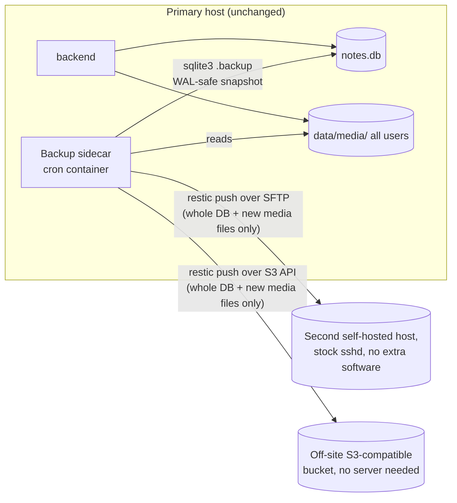

# Backup & Replication Strategy

**Status:** Draft for discussion
**Date:** 2026-09-06
**Scope:** How to automate resilient, off-site, **delta-based** backups of gecko-notes' database and per-user content files across **all users**, evaluate the "install it in multiple locations with two-way sync" idea, and recommend a default architecture.

---

## 1. Executive summary

"Backup," "replication," and "two-way sync" sound like the same idea but are three different engineering commitments:

| Term | What it guarantees | Who writes |
|---|---|---|
| **Backup** | Point-in-time copies you can restore from | One writer (the live app); backups only ever read |
| **Replication (standby/DR)** | A continuously-updated warm copy, ready to promote | One writer at a time |
| **Multi-master / active-active sync** | Two+ nodes accept writes to the *same* data concurrently and reconcile conflicts | Multiple writers, needs conflict resolution |

The goal — automated, resilient, off-site backups covering the database and every user's content files, run one-way and on a schedule — is a **backup** problem, and it's what this document designs. Live two-way sync between running instances is out of scope for the reason given briefly in §3.

**The real design question isn't "backup, yes or no" — it's "how much has to move over the wire each run, and does that cost grow as the library grows?"** The two things being backed up don't have the same growth profile: the database is small and stays small (it's text/metadata — notes, users, settings — not the bulky content itself), while the media library is where nearly all the bytes and nearly all the growth live. So the two get different, and simpler, treatment: **the database snapshot is just re-copied in full on every run** — at its size, that costs nothing worth optimizing, and trying to save bytes on it would only add complexity for no real benefit. **The media tree is where "only send what's missing" actually earns its keep**: each run checks, per file, whether the destination already has it, and sends only the files it doesn't. §4 is the centerpiece of this document and explains precisely how that check works.

**Recommendation, in one sentence:** take a consistent SQLite snapshot on a schedule and copy it whole every time, back it up together with the entire `data/media/` tree using restic (which skips any media file the destination already has, encrypted, deduplicated), fan the same backup out to two or more remote locations over plain SFTP and S3-compatible storage — **no special software needs to run on either destination** — via a small cron sidecar, all without running a second live instance of the app anywhere.

---

## 2. How the app stores data today

- **Database** — a single SQLite file at `data/db/notes.db` (bind-mounted into the backend container; `backend/app/database.py`). WAL journal mode with `synchronous=NORMAL` is enabled on every connection. There's no Alembic — schema changes are a long, idempotent sequence of `ALTER TABLE ... ADD COLUMN` statements run in `init_db()` on every backend startup.
- **Content files** — a flat, per-user tree at `data/media/{user_id}/{uuid}.ext` (also bind-mounted), covering images, video, audio, documents, and archives attached to notes. The `NoteAsset` table is the authoritative index of which file belongs to which note.
- **Media files are write-once.** `backend/app/routers/media.py`'s upload handler (`save_upload`) always mints a fresh UUID filename and writes it exactly once, streamed to disk (`open(file_path, "wb")`); nothing in the codebase reopens an existing media file to modify it in place. Editing a note that references an image just points at a different (new) file. So the media tree only ever grows via wholly-new files and shrinks via deletions — it never has a file that's 90% the same as before but slightly different. This matters directly for the delta design in §4.
- **Existing export feature is not this** — `backend/app/routers/data.py` already has a self-service export/import: a user can download a zip of *their own* notes + media, or import one. That's a user-facing data-portability feature, one user at a time, on demand — not an ops-level, whole-system, all-users backup. This document doesn't propose replacing it; the two are complementary.
- **Single Docker host** — `docker-compose.yml` runs two services (`backend`, `frontend`), with `./data/db` and `./data/media` as host bind mounts. There is no scheduler, cron, or background-job infrastructure anywhere in the repo today beyond the app's own in-process job runner.

```mermaid
flowchart LR
    subgraph Host["Single Docker host"]
        FE[frontend / nginx]
        BE[backend / FastAPI]
        DB[(data/db/notes.db<br/>SQLite, WAL)]
        MEDIA[(data/media/&#123;user_id&#125;/*<br/>all users, write-once)]
        FE --> BE
        BE --> DB
        BE --> MEDIA
    end
    NONE[No backup, no scheduler,<br/>no off-site copy] -.->|today| Host
```

---

## 3. Why not two-way live sync (brief)

WAL mode means `notes.db` is really three files kept in sync by SQLite itself (`notes.db`, `notes.db-wal`, `notes.db-shm`) plus OS-level locks. A generic file-sync tool (rsync-both-ways, Syncthing, Dropbox-style sync) has no idea any of that exists — it can copy the files at slightly different moments and produce something that opens but is subtly corrupt, and if two locations both run the app and sync changes back and forth, one side's writes silently clobber the other's with no merge and no conflict log. On top of that, `backend/app/jobs/runner.py` documents that the app is deliberately single-process, single-writer: *"running several workers or replicas would need the queue to move into the database or a broker."* So: don't sync the live database file live, in either direction, between two running instances — take consistent snapshots and move *those*. (A path to genuine multi-location active use, if it's ever actually needed, is in §6.)

---

## 4. Delta transfer: only send what's new — and why that's a media problem, not a database problem

The instinct to keep this simple is right, and it's worth being explicit about *why* the database and the media tree don't need the same mechanism, rather than applying one clever technique everywhere out of habit.

### The database: just copy the whole snapshot, every time

The SQLite file holds notes, metadata, settings, and job records — text and small structured rows, not the bulky content itself (that's what `data/media/` is for). Whatever its exact size on a given install, it's routinely smaller than a single one of the larger media files it sits alongside. At that size, trying to figure out which *parts* of the database changed since the last run and sending only those buys back essentially nothing — the whole file is cheap to send regardless — while adding a mechanism (something has to decide what changed and reconstruct the rest at restore time) that has its own edge cases to get right. **So don't bother: `sqlite3 .backup` the whole thing, every run, and send the whole result.** That single sentence is the entire database story. `restic` will still internally split that file into chunks and dedup pieces of it as a byproduct of how it stores everything — but that's restic's own bookkeeping, not something this design needs to reason about or lean on. If the database ever grew to a size where re-sending it whole every run actually hurt, that would be worth revisiting — it isn't that size today, and there's no reason to design for it pre-emptively.

### The media tree: only send files the destination doesn't already have

This is the part that actually matters, because this is where the bytes and the growth are. Per §2, every media file is write-once — once a `{uuid}.ext` exists, it never changes — so the question for each file is binary and simple: **does the destination already have a file with this content, or not?** There's no need to think about partial, in-place changes to a file, because that never happens here.

You floated doing this by hand: keep track of the last backup time, and copy everything (files, at least) created since then. That works in the common case, but it's more fragile than it needs to be — a run that fails partway through, a file whose write finishes just before or after the recorded cutoff, or a clock that drifts between the machine writing files and the one recording "last backup time" can all cause a file to be silently skipped forever or re-sent needlessly. **Restic solves the same problem more robustly by not depending on time at all**: its repository keeps an index of exactly which files (as content-hashed chunks) it already has. Each run, restic checks each file's content against that index — already there → skip it entirely, don't even read it again for transfer purposes; not there → send it. That's the same "does the destination already have this?" check you described, just keyed on content rather than on a timestamp, so a failed run or a clock mismatch can't cause a file to be missed. In practice, because these files are write-once, this collapses to exactly what you wanted: **new files get sent, unchanged files cost nothing, and nothing needs to track "since when."**

### The destination doesn't need any special software

Everything in the previous section — content hashing, checking what's already there, deciding what to send — is logic that runs on the **source** side, inside the restic client. The destination only ever needs to answer "read this," "write this," and "list what's here," which is exactly what a destination already does with nothing installed:

- **A second self-hosted host, over plain SFTP.** Restic's SFTP backend talks to the destination's stock `sshd` — the SSH server that's already running on basically any server you'd use for this, for ordinary remote access. No restic-specific software, no extra daemon, nothing to install or keep updated on that machine. SFTP and local-filesystem were restic's original backend types; they're not a lesser or newer option.
- **Off-site storage, over a plain S3-compatible API.** Backblaze B2, a MinIO instance, or similar — again, just an object-storage API restic talks to directly. Nothing runs there either.

Both give the exact same delta/dedup correctness described above — same content hashes, same "skip what's already present" behavior. The only thing you give up by not running anything on the destination is **speed of the lookup, at very large scale**: restic still has to figure out what the repository already contains before each run, and over SFTP that means listing directories rather than querying an index over HTTP. For a personal/small-team library, that stays comfortably fast — restic shards its repository into hundreds of subdirectories specifically to keep this listing cheap, and a plain SFTP repository holds up well into the multi-terabyte, tens-of-thousands-of-files range before that overhead becomes something you'd notice. This isn't a near-term concern, so it's not worth trading away "nothing to run on the destination" to pre-empt it.

If it ever does become a concern — or if you later want the extra security property of a destination that can't have its backup history deleted even by someone holding the write credential — restic's own **`rest-server`** is the upgrade path: a small HTTP server for the repository that answers "what do you have" faster at scale, and can issue append-only credentials that add new backups but can't remove or overwrite old ones. It's worth keeping in mind, but it's an optional later step, not part of the default here.

**BorgBackup** is worth naming as the alternative that was considered: it also does content-hash-based dedup, but it *always* requires a server-side process (`borg serve` over SSH) for every destination — there's no dumb-object-storage mode at all, so an off-site S3-compatible bucket isn't an option with Borg. That rules it out here, independent of the rest-server question, since one of the fan-out destinations (§5) is meant to be exactly that kind of server-free storage.

### The "backing up all day, every day" worry, directly answered

With this split, steady-state backup cost is: the whole (small) database, every run, plus only whatever media files are genuinely new since the last run. Neither part grows with the *total* size of the library — the database stays small on its own, and the media side only ever pays for what's new. A library that's grown to hundreds of gigabytes but only gains 200MB of new uploads a day still costs roughly "small DB + 200MB" per run, indefinitely — not a growing multiple of the whole library. The one unavoidable exception is the **very first backup** to a brand-new destination, which has to transfer the full media tree once, by definition — that's a one-time seed cost, not a recurring one. Given that, backup **frequency** (hourly vs. daily) should be chosen based on how much data loss is acceptable if the primary fails, not out of fear of transfer cost.

---

## 5. Recommended architecture (the default)

**Database — periodic snapshot, copied whole every run.** Use SQLite's own online backup API: `sqlite3 /app/data/db/notes.db ".backup /tmp/notes.db.snapshot"` (or the Python `sqlite3.Connection.backup()` equivalent). It's WAL-safe and doesn't corrupt or meaningfully block the live app. Per §4, there's no need to optimize what gets sent here — the whole snapshot goes every run, because at this size that's simpler and just as cheap as anything cleverer. A continuous-streaming tool like Litestream is unnecessary here too — it adds a permanently-running process and a less-familiar restore model, and an hourly snapshot already matches the granularity the app itself uses for `NoteVersion` history.

**Files — the entire `data/media/` tree, every user, every run — but only new files actually transfer.** Point restic at it alongside the fresh DB snapshot in the same run, so the database and the files it references stay consistent with each other at each restore point. Per §4, restic skips any file the destination already has, so this costs nothing beyond whatever's genuinely new since the last run.

**Multiple locations, both server-free on the destination.** Fan the same backup run out to two+ restic repositories: a second self-hosted host reached over plain SFTP (its existing `sshd`, nothing extra to install), plus an off-site S3-compatible bucket (Backblaze B2, or a MinIO instance you control). Per §4, neither needs any restic-specific software running on it — this delivers real geographic/provider redundancy without ever running a second live app instance, and without maintaining anything extra on either destination.

**Scheduling — a cron sidecar in `docker-compose.yml`.** No scheduler exists in the repo today. A small container (a cron daemon, or a tool like `mcuadros/ofelia`) added to `docker-compose.yml`, with read access to the existing `data/db` and `data/media` bind mounts, keeps the backup schedule declared and versioned alongside the app rather than living as an invisible host-level cron job that's easy to lose track of on a host rebuild.

**Retention & encryption.** A reasonable default: keep hourly snapshots for 48 hours, daily for 14 days, weekly for 8 weeks (`restic forget --keep-hourly 48 --keep-daily 14 --keep-weekly 8 --prune`, run after each backup). Restic encrypts client-side (AES-256) by default with a repository password — that password must live outside the repo, in a secret store or `.env`-style file, never committed alongside `docker-compose.yml`.

---

## 6. If genuine two-way *active* use is wanted later

If the actual goal ever becomes "log in and edit notes from two locations that are both live at once" (not just disaster recovery), that's a different and larger problem. Two paths, cheapest first:

**(a) Home-node-per-user sharding.** Every content table is already partitioned by `user_id`. Each user could be pinned to one "home" instance for writes, while other instances hold a read-only replicated copy (shipped via the same restic mechanism as §5, just restored read-only elsewhere). Reads can be served from any location; writes always route to the user's home node. Because a given user's rows never have more than one writer, no conflict resolution is needed at all. This is additive — a routing layer plus a "which node is this user's home" registry — with no changes to SQLite or the job queue.

**(b) Migrate to Postgres with logical replication.** Only worth considering if a *single user* must write from two locations simultaneously. This means replacing the SQLite engine, moving the job queue to database- or broker-backed coordination (already flagged as a prerequisite in `jobs/runner.py`), and still solving application-level conflict resolution for concurrently-edited notes — logical replication moves data, it doesn't resolve two people (or two devices) editing the same note at once. This is a multi-month rearchitecture, not a backup feature.

**Recommendation:** don't pursue either unless simultaneous same-user multi-location writes are a confirmed real requirement — and if so, start with (a).

---

## 7. Failover / restore runbook (brief)

1. On the standby location: `restic restore latest` (from whichever repo) into `data/db/` and `data/media/`.
2. Verify integrity: `sqlite3 notes.db "PRAGMA integrity_check;"`.
3. Bring the app up there: `docker compose up --build -d`.
4. Repoint the reverse proxy / DNS at the new location (update the `web` network attachment per `docker-compose.prod.yml` if using the Caddy setup described in `CLAUDE.md`).
5. Once the old primary is confirmed retired, point the backup schedule away from it and resume backups from the new primary.

---

## 8. Key touchpoints (for whoever implements this)

- `docker-compose.yml` — where the backup/cron sidecar service would be added, with read access to the existing `./data/db` and `./data/media` bind mounts.
- `backend/app/database.py` — confirms the DB path (`data/db/notes.db`) and WAL configuration the snapshot step needs to respect.
- `backend/app/routers/media.py` — confirms media files are write-once (`save_upload`), the fact the delta design in §4 relies on.
- `backend/app/routers/data.py` — the existing per-user export/import feature; keep it separate from this ops-level mechanism rather than merging the two.
- `backend/app/jobs/runner.py` — the single-process constraint that rules out live multi-instance replication until/unless §6b is undertaken.
- A new `ops/backup/` (or similar) location would hold the restic config, the snapshot script, and the sidecar's Dockerfile/crontab — none of this created as part of this document. No destination-side deployment is needed for the default setup (§4); `rest-server`, if adopted later, would live on whichever self-hosted host is chosen.

---

## 9. Open decisions (needed before implementation)

1. **Second location(s):** a second physical/VPS host you control (reached over its existing SSH access — no software to install for this), an off-site object storage account (S3-compatible), or both?
2. **`rest-server` later, if ever:** the default needs nothing extra on either destination (§4). Worth revisiting only if the self-hosted repository grows large enough that SFTP lookups are noticeably slow, or if the append-only tamper-resistance property becomes wanted — neither is a concern at today's scale.
3. **Backup frequency:** is hourly an acceptable recovery point, or is a tighter window needed? (Per §4, this is purely a data-loss-window decision — the whole-DB-every-run cost doesn't scale with frequency in any way that matters at this size.)
4. **Retention length:** does the §5 default (48h hourly / 14d daily / 8w weekly) match how far back you'd realistically want to restore from?
5. **Secret storage:** where should the restic repository password and the SSH/S3 credentials for each destination live (the app already refuses to start without `JWT_SECRET_KEY` in `.env`; the same pattern could hold these)?
6. **Failure alerting:** should a failed backup run notify you (the app already has SMTP configured for other features — reusing it is straightforward)?

---

*This document is a feasibility assessment and architecture recommendation, not an implementation. No application behavior, docker-compose configuration, or backup automation has been added yet.*
