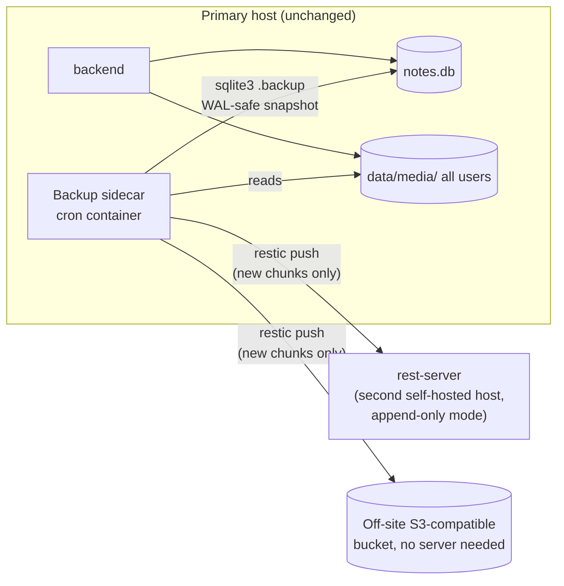

# Backup & Replication Strategy

**Status:** Draft for discussion
**Date:** 2026-09-06
**Scope:** How to automate resilient, off-site, **delta-based** backups of gecko-notes' database and per-user content files across **all users**, evaluate the "install it in multiple locations with two-way sync" idea, and recommend a default architecture.

---

## 1. Executive summary

"Backup," "replication," and "two-way sync" sound like the same idea but are three different engineering commitments:

| Term | What it guarantees | Who writes |
|---|---|---|
| **Backup** | Point-in-time copies you can restore from | One writer (the live app); backups only ever read |
| **Replication (standby/DR)** | A continuously-updated warm copy, ready to promote | One writer at a time |
| **Multi-master / active-active sync** | Two+ nodes accept writes to the *same* data concurrently and reconcile conflicts | Multiple writers, needs conflict resolution |

The goal — automated, resilient, off-site backups covering the database and every user's content files, run one-way and on a schedule — is a **backup** problem, and it's what this document designs. Live two-way sync between running instances is out of scope for the reason given briefly in §3.

**The real design question isn't "backup, yes or no" — it's "how much has to move over the wire each run, and does that cost grow as the library grows?"** As the notes and media library gets larger, re-sending everything on every run would make backups take longer and longer indefinitely. The fix is **delta transfer**: each run sends only the data that's missing from or changed relative to the destination, with the destination itself answering "here's what I already have" so the source knows what to skip. Restic — the tool this document recommends — already does exactly that, at the byte-chunk level, not just the whole-file level. §4 is the centerpiece of this document and explains precisely how.

**Recommendation, in one sentence:** take a consistent SQLite snapshot on a schedule, back it up together with the entire `data/media/` tree using restic (which transfers only new/changed data, encrypted, deduplicated), run **rest-server** on at least one destination so that negotiation stays fast as the repository grows, and fan the same backup out to two or more remote locations via a small cron sidecar — all without running a second live instance of the app anywhere.

---

## 2. How the app stores data today

- **Database** — a single SQLite file at `data/db/notes.db` (bind-mounted into the backend container; `backend/app/database.py`). WAL journal mode with `synchronous=NORMAL` is enabled on every connection. There's no Alembic — schema changes are a long, idempotent sequence of `ALTER TABLE ... ADD COLUMN` statements run in `init_db()` on every backend startup.
- **Content files** — a flat, per-user tree at `data/media/{user_id}/{uuid}.ext` (also bind-mounted), covering images, video, audio, documents, and archives attached to notes. The `NoteAsset` table is the authoritative index of which file belongs to which note.
- **Media files are write-once.** `backend/app/routers/media.py`'s upload handler (`save_upload`) always mints a fresh UUID filename and writes it exactly once, streamed to disk (`open(file_path, "wb")`); nothing in the codebase reopens an existing media file to modify it in place. Editing a note that references an image just points at a different (new) file. So the media tree only ever grows via wholly-new files and shrinks via deletions — it never has a file that's 90% the same as before but slightly different. This matters directly for the delta design in §4.
- **Existing export feature is not this** — `backend/app/routers/data.py` already has a self-service export/import: a user can download a zip of *their own* notes + media, or import one. That's a user-facing data-portability feature, one user at a time, on demand — not an ops-level, whole-system, all-users backup. This document doesn't propose replacing it; the two are complementary.
- **Single Docker host** — `docker-compose.yml` runs two services (`backend`, `frontend`), with `./data/db` and `./data/media` as host bind mounts. There is no scheduler, cron, or background-job infrastructure anywhere in the repo today beyond the app's own in-process job runner.

```mermaid
flowchart LR
    subgraph Host["Single Docker host"]
        FE[frontend / nginx]
        BE[backend / FastAPI]
        DB[(data/db/notes.db<br/>SQLite, WAL)]
        MEDIA[(data/media/&#123;user_id&#125;/*<br/>all users, write-once)]
        FE --> BE
        BE --> DB
        BE --> MEDIA
    end
    NONE[No backup, no scheduler,<br/>no off-site copy] -.->|today| Host
```

---

## 3. Why not two-way live sync (brief)

WAL mode means `notes.db` is really three files kept in sync by SQLite itself (`notes.db`, `notes.db-wal`, `notes.db-shm`) plus OS-level locks. A generic file-sync tool (rsync-both-ways, Syncthing, Dropbox-style sync) has no idea any of that exists — it can copy the files at slightly different moments and produce something that opens but is subtly corrupt, and if two locations both run the app and sync changes back and forth, one side's writes silently clobber the other's with no merge and no conflict log. On top of that, `backend/app/jobs/runner.py` documents that the app is deliberately single-process, single-writer: *"running several workers or replicas would need the queue to move into the database or a broker."* So: don't sync the live database file live, in either direction, between two running instances — take consistent snapshots and move *those*. (A path to genuine multi-location active use, if it's ever actually needed, is in §6.)

---

## 4. Delta transfer: only send what's changed

This is the part that makes the recommendation actually workable as the library grows, so it's worth walking through precisely rather than waving at "restic does dedup."

### How restic decides what's new

Restic doesn't diff whole files. It splits every input (each media file, and the SQLite snapshot file) into variable-size chunks using a rolling hash (content-defined chunking, or CDC) that picks cut points based on the data itself, not fixed byte offsets. Each chunk gets hashed (SHA-256) into a content-addressed ID. Before a chunk is uploaded, restic checks that hash against the destination repository's existing index — already present → skip it, just reference the existing chunk in this run's new snapshot manifest; not present → upload it. **Only genuinely new chunks, plus a small manifest, cross the wire on each run.** This is precisely the negotiation you described: the source effectively asks "do you have this?", the destination's index answers, and only the gap moves.

This plays out differently for the two things being backed up:

- **Media files (write-once, per §2): the easy case.** A new upload is 100% new content, so its chunks upload once, in full — there's no way around that, it's genuinely new data. But nothing about the *rest* of the multi-gigabyte media tree gets re-scanned or re-sent just because one new file showed up. Add one 50MB video today, and tomorrow's backup transfers roughly 50MB — not the whole library. Deleted files simply aren't referenced by future snapshots; their chunks get reclaimed later by pruning (§5), not re-transferred.
- **The SQLite snapshot: the case that actually needs chunk-level dedup, not whole-file dedup.** Two successive `sqlite3 .backup` outputs will have completely different whole-file hashes — a WAL checkpoint reorders things even when the underlying data barely changed — so a naive "has the file's hash changed? if so, re-upload it" approach would re-transfer the entire database on every single run, forever. But at the page level, most of a SQLite file is untouched between two backups taken an hour apart — only the pages that were actually written to differ. Restic's rolling-hash chunk boundaries re-synchronize after an edit (an insertion or deletion doesn't shift every downstream chunk boundary the way naive fixed-size blocking would), so most chunks in the new snapshot match chunks already sitting in the repo from the last one. **Net effect: transfer cost tracks changed database pages, not file size — even though the file's own hash is different every time.** This is the specific reason to keep a CDC-based tool here rather than a "copy if changed" script.

### What running something on the destination adds: `rest-server`

You said you don't mind running something on the destination — that's exactly what makes this efficient. **`rest-server`** is restic's own small HTTP server for a repository. Run it on at least one destination host, and it gives two concrete things a plain SFTP/S3 backend doesn't:

- **Fast "what do you already have" as the repository grows.** Over raw SFTP, restic still has to enumerate the repository's pack/index files to figure out what already exists before each run; that gets slower as the object count grows into the hundreds of thousands. `rest-server` serves that index directly over HTTP, so the negotiation stays fast regardless of how large the backup history gets — the exact "source asks, destination answers, only the gap moves" behavior you described.
- **Append-only mode.** `rest-server --append-only` issues credentials that can add new snapshots but cannot delete or overwrite existing ones. If the source host is ever compromised, whoever has that credential still can't wipe or tamper with prior backups — a real security property that plain SFTP/S3 credentials don't give you without extra setup.

**BorgBackup** is worth naming as the alternative: it does the same kind of chunk-level negotiation, but it *requires* a server-side process (`borg serve` over SSH) for every single destination — there's no "plain object storage" mode. Since one of the fan-out destinations here is meant to be off-site S3-compatible storage (§5) with no server needed, **restic + rest-server is the better fit**: `rest-server` where you want the append-only guarantee and fast negotiation (your own second host), and restic's native S3 backend where you don't need a server at all (off-site object storage).

### The "backing up all day, every day" worry, directly answered

With delta transfer in place, steady-state backup duration and bandwidth track **daily churn** — new uploads plus changed database pages since the last run — not total library size. A library that's 500GB today and grows by 200MB a day costs roughly 200MB/day to back up indefinitely, not a growing multiple of 500GB. The one unavoidable exception is the **very first backup** to a brand-new destination, which has to transfer the full dataset once, by definition — that's a one-time seed cost, not a recurring one. Given that, backup **frequency** (hourly vs. daily DB snapshots) should be chosen based on how much data loss is acceptable if the primary fails, not out of fear of transfer cost — the transfer cost itself no longer scales with total library size once delta transfer is in place.

---

## 5. Recommended architecture (the default)

**Database — periodic snapshot, not continuous streaming.** Use SQLite's own online backup API: `sqlite3 /app/data/db/notes.db ".backup /tmp/notes.db.snapshot"` (or the Python `sqlite3.Connection.backup()` equivalent). It's WAL-safe, doesn't corrupt or meaningfully block the live app, and produces a single consistent file for restic to chunk. A continuous-streaming tool like Litestream is unnecessary here — it adds a permanently-running process and a less-familiar restore model, and an hourly snapshot already matches the granularity the app itself uses for `NoteVersion` history.

**Files — the entire `data/media/` tree, every user, every run.** Bundle it with the fresh DB snapshot in the same restic run, so the database and the files it references stay consistent with each other at each restore point. Per §4, this costs almost nothing beyond whatever's genuinely new since the last run.

**Multiple locations, mixed backend types.** Fan the same backup run out to two+ restic repositories: a second self-hosted host running `rest-server` in append-only mode (fast negotiation, tamper-resistant), plus an off-site S3-compatible bucket (Backblaze B2, or a MinIO instance you control) needing no server at all. This delivers real geographic/provider redundancy without ever running a second live app instance.

**Scheduling — a cron sidecar in `docker-compose.yml`.** No scheduler exists in the repo today. A small container (a cron daemon, or a tool like `mcuadros/ofelia`) added to `docker-compose.yml`, with read access to the existing `data/db` and `data/media` bind mounts, keeps the backup schedule declared and versioned alongside the app rather than living as an invisible host-level cron job that's easy to lose track of on a host rebuild.

**Retention & encryption.** A reasonable default: keep hourly snapshots for 48 hours, daily for 14 days, weekly for 8 weeks (`restic forget --keep-hourly 48 --keep-daily 14 --keep-weekly 8 --prune`, run after each backup). Restic encrypts client-side (AES-256) by default with a repository password — that password must live outside the repo, in a secret store or `.env`-style file, never committed alongside `docker-compose.yml`.

---

## 6. If genuine two-way *active* use is wanted later

If the actual goal ever becomes "log in and edit notes from two locations that are both live at once" (not just disaster recovery), that's a different and larger problem. Two paths, cheapest first:

**(a) Home-node-per-user sharding.** Every content table is already partitioned by `user_id`. Each user could be pinned to one "home" instance for writes, while other instances hold a read-only replicated copy (shipped via the same restic mechanism as §5, just restored read-only elsewhere). Reads can be served from any location; writes always route to the user's home node. Because a given user's rows never have more than one writer, no conflict resolution is needed at all. This is additive — a routing layer plus a "which node is this user's home" registry — with no changes to SQLite or the job queue.

**(b) Migrate to Postgres with logical replication.** Only worth considering if a *single user* must write from two locations simultaneously. This means replacing the SQLite engine, moving the job queue to database- or broker-backed coordination (already flagged as a prerequisite in `jobs/runner.py`), and still solving application-level conflict resolution for concurrently-edited notes — logical replication moves data, it doesn't resolve two people (or two devices) editing the same note at once. This is a multi-month rearchitecture, not a backup feature.

**Recommendation:** don't pursue either unless simultaneous same-user multi-location writes are a confirmed real requirement — and if so, start with (a).

---

## 7. Failover / restore runbook (brief)

1. On the standby location: `restic restore latest` (from whichever repo) into `data/db/` and `data/media/`.
2. Verify integrity: `sqlite3 notes.db "PRAGMA integrity_check;"`.
3. Bring the app up there: `docker compose up --build -d`.
4. Repoint the reverse proxy / DNS at the new location (update the `web` network attachment per `docker-compose.prod.yml` if using the Caddy setup described in `CLAUDE.md`).
5. Once the old primary is confirmed retired, point the backup schedule away from it and resume backups from the new primary.

---

## 8. Key touchpoints (for whoever implements this)

- `docker-compose.yml` — where the backup/cron sidecar service would be added, with read access to the existing `./data/db` and `./data/media` bind mounts.
- `backend/app/database.py` — confirms the DB path (`data/db/notes.db`) and WAL configuration the snapshot step needs to respect.
- `backend/app/routers/media.py` — confirms media files are write-once (`save_upload`), the fact the delta design in §4 relies on.
- `backend/app/routers/data.py` — the existing per-user export/import feature; keep it separate from this ops-level mechanism rather than merging the two.
- `backend/app/jobs/runner.py` — the single-process constraint that rules out live multi-instance replication until/unless §6b is undertaken.
- A new `ops/backup/` (or similar) location would hold the restic config, the snapshot script, and the sidecar's Dockerfile/crontab, plus a `rest-server` deployment on the chosen self-hosted destination — none of this created as part of this document.

---

## 9. Open decisions (needed before implementation)

1. **Second location(s):** a second physical/VPS host you control (running `rest-server`), an off-site object storage account (S3-compatible), or both?
2. **`rest-server` vs. plain SFTP on the self-hosted destination:** `rest-server` (recommended — faster negotiation as the repo grows, append-only mode) vs. plain SFTP (simpler to stand up, but slower "what do you already have" checks over time and no append-only protection)?
3. **Backup frequency:** is hourly an acceptable recovery point, or is a tighter window needed? (Per §4, this is now purely a data-loss-window decision, not a bandwidth one.)
4. **Retention length:** does the §5 default (48h hourly / 14d daily / 8w weekly) match how far back you'd realistically want to restore from?
5. **Secret storage:** where should the restic repository password and any remote-storage/`rest-server` credentials live (the app already refuses to start without `JWT_SECRET_KEY` in `.env`; the same pattern could hold these)?
6. **Failure alerting:** should a failed backup run notify you (the app already has SMTP configured for other features — reusing it is straightforward)?

---

*This document is a feasibility assessment and architecture recommendation, not an implementation. No application behavior, docker-compose configuration, or backup automation has been added yet.*
