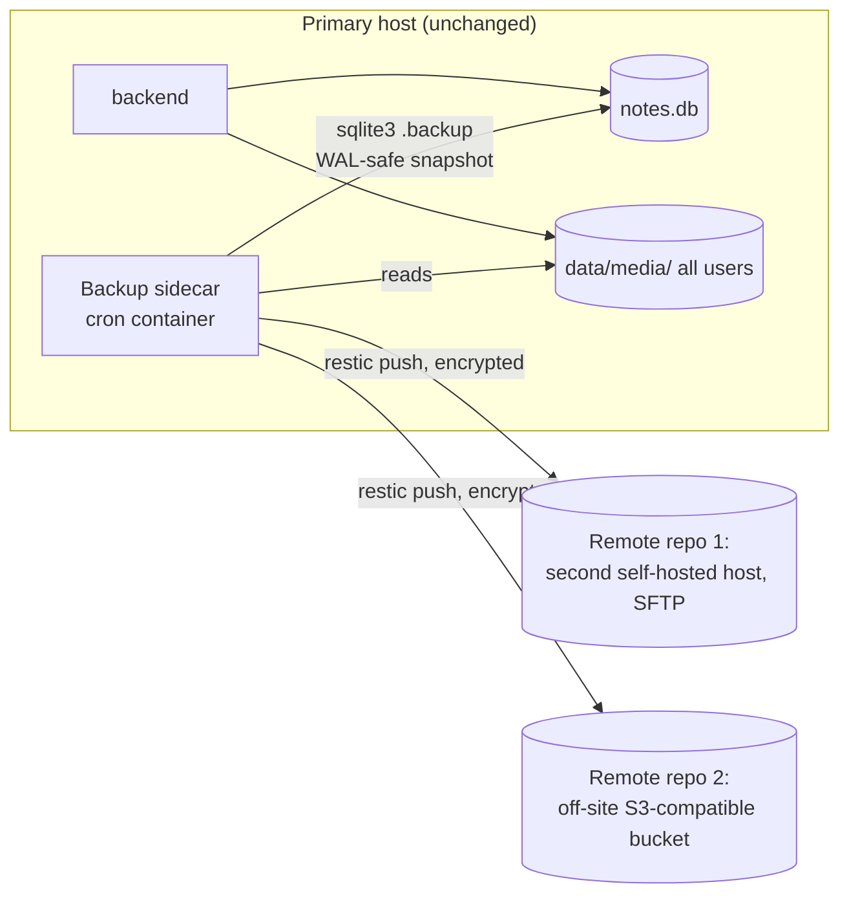

# Backup & Replication Strategy

**Status:** Draft for discussion
**Date:** 2026-09-06
**Scope:** How to automate resilient, off-site backups of gecko-notes' database and per-user content files across **all users**, evaluate the "install it in multiple locations with two-way sync" idea, and recommend a default architecture.

---

## 1. Executive summary

"Backup," "replication," and "two-way sync" sound like the same idea but are three different engineering commitments:

| Term | What it guarantees | Who writes |
|---|---|---|
| **Backup** | Point-in-time copies you can restore from | One writer (the live app); backups only ever read |
| **Replication (standby/DR)** | A continuously-updated warm copy, ready to promote | One writer at a time |
| **Multi-master / active-active sync** | Two+ nodes accept writes to the *same* data concurrently and reconcile conflicts | Multiple writers, needs conflict resolution |

The goal stated first — automated, resilient, off-site backups covering the database and every user's content files — is a **backup** problem. The "two-way replication" idea is closer to **multi-master sync**, and gecko-notes' current architecture makes that fundamentally unsafe today (details in §3). The good news: the backup problem is well-understood, cheap to solve properly, and doesn't require touching any application code.

**Recommendation, in one sentence:** take a consistent SQLite snapshot on a schedule, back it up together with the entire `data/media/` tree using an encrypted, deduplicating backup tool (restic), and fan that out to two or more remote locations via a small cron sidecar — all without running a second live instance of the app anywhere. Full details in §4; a path to genuine multi-location *active* use, if it's ever actually needed, is in §5.

---

## 2. How the app stores data today

- **Database** — a single SQLite file at `data/db/notes.db` (bind-mounted into the backend container; `backend/app/database.py`). WAL journal mode with `synchronous=NORMAL` is enabled on every connection. There's no Alembic — schema changes are a long, idempotent sequence of `ALTER TABLE ... ADD COLUMN` statements run in `init_db()` on every backend startup.
- **Content files** — a flat, per-user tree at `data/media/{user_id}/{uuid}.ext` (also bind-mounted), covering images, video, audio, documents, and archives attached to notes. The `NoteAsset` table is the authoritative index of which file belongs to which note; the comment on that table is explicit: *"Media itself lives on disk in a flat, per-user tree ... this table is the only thing that knows which note a file belongs to."*
- **Existing export feature is not this** — `backend/app/routers/data.py` already has a self-service export/import: a user can download a zip of *their own* notes + media, or import one. That's a user-facing data-portability feature, one user at a time, on demand. It is not an ops-level, whole-system, all-users backup, and this document doesn't propose replacing it — the two are complementary.
- **Single Docker host** — `docker-compose.yml` runs two services (`backend`, `frontend`), with `./data/db` and `./data/media` as host bind mounts. `docker-compose.prod.yml` is a thin overlay that joins the frontend to an external `web` network for a reverse proxy. There is no scheduler, cron, or background-job infrastructure anywhere in the repo today beyond the app's own in-process job runner.

```mermaid
flowchart LR
    subgraph Host["Single Docker host"]
        FE[frontend / nginx]
        BE[backend / FastAPI]
        DB[(data/db/notes.db<br/>SQLite, WAL)]
        MEDIA[(data/media/&#123;user_id&#125;/*<br/>all users)]
        FE --> BE
        BE --> DB
        BE --> MEDIA
    end
    NONE[No backup, no scheduler,<br/>no off-site copy] -.->|today| Host
```

---

## 3. Why "two-way replication" is the wrong default here

### SQLite in WAL mode is not one file you can safely sync live

WAL mode means `notes.db` is really three files kept in sync by SQLite itself: `notes.db`, `notes.db-wal`, and `notes.db-shm`, plus OS-level locks that coordinate readers and the one writer. A generic file-sync tool (rsync, Syncthing, Dropbox-style two-way sync) has no idea any of that exists:

- It can copy `notes.db` mid-transaction, or copy the main file and the WAL file at slightly different moments, producing a file that *opens* but is subtly inconsistent — corruption that often isn't noticed until a query fails weeks later.
- If a second location also runs the app and both sides sync changes back and forth, you get two independently-mutating SQLite files. A "sync" between them doesn't merge — it's a file-level operation, so one side's changes silently clobber the other's. There is no conflict log, no undo.

### The app is architecturally single-process, single-writer

This isn't an incidental limitation — it's a documented design decision. `backend/app/jobs/runner.py` (which drives video rendering, transcription, and AI-assistant background work) states it directly:

> "Single process only, deliberately... That matches how this app is deployed (one uvicorn process over SQLite); running several workers or replicas would need the queue to move into the database or a broker, and this file is where that change would go."

SQLite itself also only ever allows one writer at a time. Put together: running two live instances that both accept writes — which is what "install in multiple locations, replicate back and forth" implies — isn't a configuration problem to work around, it's a rearchitecture (see §5b).

**Conclusion:** don't sync the live database file, in either direction, between two running instances. Take consistent snapshots and move *those*.

---

## 4. Recommended architecture (the default)

**Database — periodic snapshot, not continuous streaming.** Use SQLite's own online backup API: `sqlite3 /app/data/db/notes.db ".backup /tmp/notes.db.snapshot"` (or the Python `sqlite3.Connection.backup()` equivalent). It's WAL-safe, doesn't corrupt or meaningfully block the live app, and produces a single consistent file. A continuous-streaming tool like Litestream is overkill here — it adds a permanently-running process and its own less-familiar restore model for an app this size, and an hourly snapshot already matches the granularity the app itself uses for `NoteVersion` history.

**Files — the entire `data/media/` tree, every user, every run.** Back it up together with the fresh DB snapshot in the same run, so the database and the files it references stay consistent with each other at each restore point.

**Tooling — restic (or borgbackup), not plain rsync/rclone mirroring.** Restic gives three things a plain mirror doesn't: client-side encryption (required, since backups leave the origin server), content-addressed deduplication (cheap incrementals even with large binary media), and real snapshot history with retention pruning. A plain mirror has none of that — if the source is ever wrong (bad data, ransomware, accidental deletion), a mirror just faithfully propagates the mistake instead of protecting against it.

**Multiple locations — fan out one backup run to two+ restic repositories.** For example: a second self-hosted machine reachable over SFTP (restic's `sftp:` backend) for a same-org warm copy, plus an off-site S3-compatible bucket (Backblaze B2, or a MinIO instance you control) for geographic/provider redundancy. This delivers "multiple locations" without ever running a second live app instance.

**Scheduling — a cron sidecar in `docker-compose.yml`.** There's no scheduler in the repo today. A small container (e.g. a cron daemon or a tool like `mcuadros/ofelia`) added to `docker-compose.yml`, with read access to the same `data/db` and `data/media` bind mounts, keeps the backup schedule declared and versioned alongside the app rather than living as an invisible host-level cron job that's easy to lose track of on a host rebuild.

**Retention & encryption.** A reasonable default: keep hourly snapshots for 48 hours, daily for 14 days, weekly for 8 weeks (`restic forget --keep-hourly 48 --keep-daily 14 --keep-weekly 8 --prune`, run after each backup). Restic encrypts client-side (AES-256) by default with a repository password — that password must live outside the repo, in a secret store or `.env`-style file, never committed alongside `docker-compose.yml`.

---

## 5. If genuine two-way *active* use is wanted later

If the actual goal ever becomes "log in and edit notes from two locations that are both live at once" (not just disaster recovery), that's a different and larger problem. Two paths, cheapest first:

**(a) Home-node-per-user sharding.** Every content table is already partitioned by `user_id`. Each user could be pinned to one "home" instance for writes, while other instances hold a read-only replicated copy (shipped via the same snapshot mechanism as §4, just restored read-only elsewhere). Reads can be served from any location; writes always route to the user's home node. Because a given user's rows never have more than one writer, no conflict resolution is needed at all. This is additive — a routing layer plus a "which node is this user's home" registry — with no changes to SQLite or the job queue.

**(b) Migrate to Postgres with logical replication.** Only worth considering if a *single user* must write from two locations simultaneously. This means replacing the SQLite engine, moving the job queue to database- or broker-backed coordination (already flagged as a prerequisite in `jobs/runner.py`), and still solving application-level conflict resolution for concurrently-edited notes — logical replication moves data, it doesn't resolve two people (or two devices) editing the same note at once. This is a multi-month rearchitecture, not a backup feature.

**Recommendation:** don't pursue either unless simultaneous same-user multi-location writes are a confirmed real requirement — and if so, start with (a).

---

## 6. Failover / restore runbook (brief)

1. On the standby location: `restic restore latest` (from whichever repo) into `data/db/` and `data/media/`.
2. Verify integrity: `sqlite3 notes.db "PRAGMA integrity_check;"`.
3. Bring the app up there: `docker compose up --build -d`.
4. Repoint the reverse proxy / DNS at the new location (update the `web` network attachment per `docker-compose.prod.yml` if using the Caddy setup described in `CLAUDE.md`).
5. Once the old primary is confirmed retired, point the backup schedule away from it and resume backups from the new primary.

---

## 7. Key touchpoints (for whoever implements this)

- `docker-compose.yml` — where the backup/cron sidecar service would be added, with read access to the existing `./data/db` and `./data/media` bind mounts.
- `backend/app/database.py` — confirms the DB path (`data/db/notes.db`) and WAL configuration the snapshot step needs to respect.
- `backend/app/routers/data.py` — the existing per-user export/import feature; keep it separate from this ops-level mechanism rather than merging the two.
- `backend/app/jobs/runner.py` — the single-process constraint that rules out live multi-instance replication until/unless §5b is undertaken.
- A new `ops/backup/` (or similar) location would hold the restic config, the snapshot script, and the sidecar's Dockerfile/crontab — not created as part of this document.

---

## 8. Open decisions (needed before implementation)

1. **Second location(s):** a second physical/VPS host you control (for SFTP), an off-site object storage account (S3-compatible), or both?
2. **Backup frequency:** is hourly an acceptable recovery point, or is a tighter window needed?
3. **Retention length:** does the §4 default (48h hourly / 14d daily / 8w weekly) match how far back you'd realistically want to restore from?
4. **Secret storage:** where should the restic repository password and any remote-storage credentials live (the app already refuses to start without `JWT_SECRET_KEY` in `.env`; the same pattern could hold these)?
5. **Failure alerting:** should a failed backup run notify you (the app already has SMTP configured for other features — reusing it is straightforward)?

---

*This document is a feasibility assessment and architecture recommendation, not an implementation. No application behavior, docker-compose configuration, or backup automation has been added yet.*
