# gecko-notes — System ER Diagram

Entity-relationship diagram of the entire gecko-notes data model.

- **Source of truth:** [`backend/app/models.py`](../backend/app/models.py) — SQLModel tables persisted to **SQLite** (`data/db/notes.db`). Schema changes are applied at startup by `init_db()` / `_run_migrations()` in [`backend/app/database.py`](../backend/app/database.py).
- **Table names** in the database are the lower-cased model names (`User` → `user`, `NoteVersion` → `noteversion`, …).
- A standalone copy of just the diagram source lives in [`er-diagram.mmd`](./er-diagram.mmd) for use with Mermaid tooling.

## Diagram

```mermaid
erDiagram

    %% ---- Users & identity ----
    User {
        string   id                PK
        string   username          UK
        string   email             UK
        string   hashed_password
        bool     is_active
        bool     is_admin
        string   avatar_url
        datetime created_at
        datetime last_login
    }

    %% ---- Content: categories, folders, notes ----
    Category {
        string id         PK
        string label
        string emoji
        string color        "hex, e.g. #3B82F6"
        bool   is_default
        int    sort_order
    }

    Folder {
        string   id                PK
        string   name
        string   parent_folder_id  FK "self-ref; null = top level"
        string   user_id           "app-level ref to User.id"
        int      sort_order
        string   icon_type          "emoji / lucide"
        string   icon_value
        string   color
        string   system_key        "e.g. archive bin; null = normal"
        datetime created_at
        datetime modified_at
    }

    Note {
        string   id                PK
        string   title
        text     content            "BlockNote JSON"
        string   category_id       FK
        string   folder_id         FK "null = root"
        string   parent_note_id    FK "self-ref; null = top-level"
        text     tags               "JSON array"
        bool     is_pinned
        bool     is_shared
        string   share_token
        int      like_count         "public likes on shared page"
        text     summary
        text     conversation       "legacy inline chat; JSON"
        datetime created_at
        datetime modified_at
        string   user_id           "app-level ref to User.id"
    }

    NoteVersion {
        string   id                PK
        string   note_id           FK
        string   user_id           "app-level ref to User.id"
        string   title
        text     content            "snapshot"
        string   content_checksum   "SHA-256 for dedup"
        string   category_id        "snapshot value (no FK)"
        text     tags               "JSON array snapshot"
        datetime created_at
    }

    Annotation {
        string   id                PK
        string   note_id           FK
        string   user_id           "app-level ref to User.id"
        string   block_id           "BlockNote block anchor"
        string   text               "markdown body"
        datetime created_at
        datetime modified_at
    }

    %% ---- AI / assistant subsystem ----
    AIProvider {
        string id             PK
        string name
        string provider_type   "anthropic / openai / deepseek / ollama / custom"
        string api_key
        string base_url
        string model
        int    max_tokens
        bool   supports_images
        bool   enabled
        bool   is_active
        string user_id         "app-level ref to User.id"
    }

    SystemPrompt {
        string id         PK
        string name
        text   content
        bool   is_active
        int    sort_order
        string user_id     "app-level ref to User.id"
    }

    AISession {
        string   id                    PK
        string   note_id               FK "null = global (list-view) session"
        string   user_id               "app-level ref to User.id"
        string   name
        text     messages               "JSON"
        string   context_scope
        bool     use_summaries
        bool     include_linked_files
        bool     plan_mode
        datetime created_at
        datetime updated_at
    }

    %% ---- Usage, jobs, personalization ----
    UsageEvent {
        string   id             PK
        string   user_id        "app-level ref to User.id"
        string   kind            "tts / stt / ai / image"
        string   provider
        string   model
        int      units
        string   unit_type       "chars / seconds / tokens / images"
        datetime created_at
        string   external_ref    "provider request id"
        float    cost
        string   currency
        bool     cost_estimated
    }

    TranscriptionJob {
        string   id               PK
        string   user_id          "app-level ref to User.id"
        string   source_filename   "video in user media dir"
        string   status            "queued / processing / done / error"
        string   result_filename
        string   error_message
        datetime created_at
        datetime updated_at
    }

    VideoRenderJob {
        string   id                 PK
        string   user_id            "app-level ref to User.id"
        string   note_id            "app-level ref to Note.id"
        string   status             "queued / processing / done / error / cancelled"
        string   stage              "Narrating / Rendering / Stitching"
        int      progress           "0-100"
        string   detail             "e.g. segment 7 of 19"
        string   options            "RenderOptions, JSON as text"
        string   quality            "preview / full"
        string   note_title         "snapshot, for download filenames"
        string   result_filename    "rendered .mp4 in user media dir"
        string   subtitle_filename  ".srt sidecar"
        string   thumbnail_filename "poster .jpg"
        float    duration_seconds
        int      size_bytes
        bool     inserted           "appended to the note when done"
        string   error_message
        datetime created_at
        datetime updated_at
    }

    Theme {
        string   id             PK
        string   name
        string   user_id        "null = global theme"
        bool     is_global
        string   mode            "light / dark"
        string   bg_type         "flat / gradient / image"
        string   bg_color1
        string   bg_color2
        string   bg_image_url
        string   bg_image_mode   "repeat / stretch / fill"
        float    bg_blur
        float    glass_opacity
        float    glass_blur
        float    shadow_size
        float    shadow_blur
        datetime created_at
    }

    %% ---- Global / shared configuration ----
    AppSetting {
        string key    PK
        text   value   "JSON-serialised"
    }

    UserSetting {
        string user_id  PK "app-level ref to User.id"
        string key      PK
        text   value      "JSON-serialised"
    }

    ModelCatalogEntry {
        string   id          PK
        string   kind         "image / tts / stt"
        string   model_id     "fal endpoint id"
        string   label
        string   maker_note
        int      sort_order
        bool     is_active
        text     voices       "JSON (tts only)"
        string   text_field
        string   voice_field
        text     extra_params "JSON (tts only)"
        datetime created_at
    }

    %% ============================================================
    %%  Relationships
    %% ============================================================

    %% -- Declared foreign keys (enforced by the schema) --
    Category ||--o{ Note        : "classifies"
    Folder   |o--o{ Note        : "contains"
    Folder   |o--o{ Folder      : "nests (parent_folder_id)"
    Note     |o--o{ Note        : "nests (parent_note_id)"
    Note     ||--o{ NoteVersion : "snapshots"
    Note     ||--o{ Annotation  : "anchors"

    %% -- Note-scoped AI sessions (note_id nullable -> global sessions) --
    Note |o--o{ AISession       : "scopes"

    %% -- Article-to-video renders (app-level note_id, not a DB FK) --
    Note ||--o{ VideoRenderJob  : "renders"

    %% -- Application-level ownership (user_id columns; not DB FKs) --
    User ||--o{ NoteVersion      : "authors"
    User ||--o{ UserSetting      : "has"
    User ||--o{ UsageEvent       : "generates"
    User ||--o{ AISession        : "runs"
    User ||--o{ TranscriptionJob : "requests"
    User ||--o{ VideoRenderJob   : "requests"
    User |o--o{ Note             : "owns"
    User |o--o{ Folder           : "owns"
    User |o--o{ Annotation       : "writes"
    User |o--o{ AIProvider       : "configures"
    User |o--o{ SystemPrompt     : "defines"
    User |o--o{ Theme            : "customizes"
```

## Using it in Mermaid

The diagram above renders automatically on GitHub. To work with it elsewhere:

- **Live editor:** paste [`er-diagram.mmd`](./er-diagram.mmd) into <https://mermaid.live>.
- **CLI** (`@mermaid-js/mermaid-cli`): `mmdc -i docs/er-diagram.mmd -o docs/er-diagram.svg`
- **Editors:** the Mermaid preview extensions for VS Code / JetBrains open `.mmd` files directly.
- The project already bundles Mermaid (`mermaid@^11` in `frontend/`), so the same syntax renders inside the app's diagram blocks.

## Reading the diagram

Cardinality is written on each relationship end (Mermaid crow's-foot notation):

| Symbol | Meaning              |
| ------ | -------------------- |
| `||`   | exactly one          |
| `|o`   | zero or one          |
| `o{`   | zero or many         |
| `}|`   | one or many          |

So `Category ||--o{ Note` reads "one Category classifies zero-or-many Notes; every Note has exactly one Category", while `User |o--o{ Note` reads "a Note optionally belongs to one User".

## Notes on the schema

- **Declared vs. application-level relationships.** Only six columns are real database foreign keys (`foreign_key=` in `models.py`): `Note.category_id`, `Note.folder_id`, `Note.parent_note_id`, `Folder.parent_folder_id`, `NoteVersion.note_id`, and `Annotation.note_id`. Every `user_id` column is a plain indexed `TEXT` column added by migration and joined in application code — ownership is enforced by the app, not by a DB constraint. These are drawn but grouped separately above.
- **Self-referential hierarchies.** `Folder.parent_folder_id` builds the folder tree, and `Note.parent_note_id` nests child notes inside a parent (embedded BlockNote "childNote" blocks). A null parent means top-level.
- **Per-user vs. global rows.** `Category`, `AppSetting`, and `ModelCatalogEntry` are global (no `user_id`). `Theme` is global when `user_id` is null (`is_global = true`), otherwise per-user. Everything else is scoped to a `user_id`.
- **Denormalized snapshots.** `NoteVersion` stores `category_id` and `tags` as copied values at snapshot time — they are not live foreign keys, so they are intentionally left unlinked.
- **JSON stored as text.** Following the codebase convention, several columns hold JSON serialized into a text column rather than a related table: `Note.content` / `tags` / `conversation`, `AISession.messages`, `NoteVersion.content` / `tags`, `AppSetting.value`, `UserSetting.value`, and the TTS override fields on `ModelCatalogEntry`.
- **Media lives on disk, not in the database.** Uploaded images, generated audio/images, recorded video, and rendered article videos referenced by `Theme.bg_image_url`, `TranscriptionJob.source_filename` / `result_filename`, `VideoRenderJob.result_filename` / `subtitle_filename` / `thumbnail_filename`, and note attachments are stored in the bind-mounted `data/media/` volume — there is no media table. Render artefacts are the one kind swept on startup (see `VIDEO_JOB_RETENTION_DAYS`), and only when the video was never added to a note.
