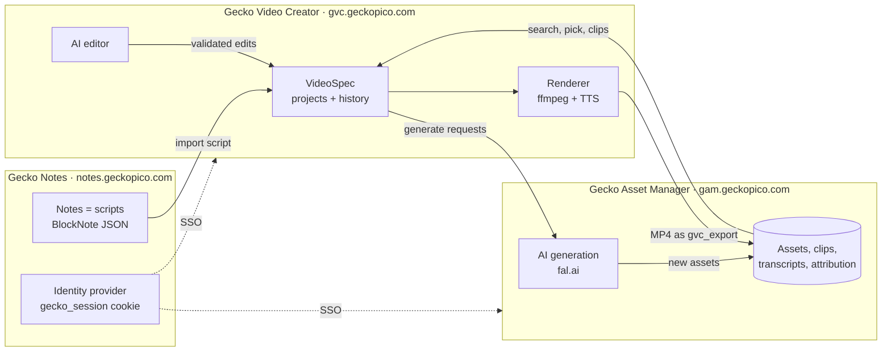
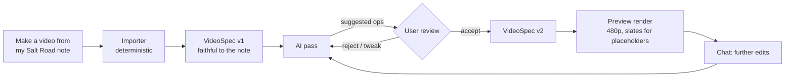

# Gecko Video Creator (GVC) — Product & Data Model Spec

**Status:** Draft for discussion
**Date:** 2026-10-07
**Scope:** What GVC is, the JSON document a video is described by (the **VideoSpec**),
how an AI builds and edits one, and how GVC pulls scripts from Gecko Notes and media
from GAM. This is a product and data-model spec, not an implementation.

---

## 1. Executive summary

Gecko Notes already turns a note into a narrated MP4 ("Article to video",
[`backend/app/video/`](../backend/app/video/)). It works, but its idea of what a video
*is* only exists **implicitly**. The structure is inferred from the note's block layout
every time it renders: an image starts a segment, the text under it is read aloud, and a
quote becomes its own shot. The look and feel comes from one global settings object. You
can't open that structure, edit it, or ask an AI to change one part of it, because it
never exists as a thing.

**Gecko Video Creator** (`gvc.geckopico.com`) is the third app in the suite. It pulls
video out of Notes and makes that structure explicit:

- A video is a **JSON document, the VideoSpec**: ordered segments, the narration beats
  inside them, overlays, any number of audio tracks, and references to assets. The
  editor UI and the AI both edit this one document, and the renderer reads only this
  document.
- **Timing is segment-anchored.** Music, sound effects and overlays attach to segments
  and to the beats within them, for example "start at *The caravans*, end after *The
  market*". Narration decides how long things last, and exact seconds are only worked
  out at render time. Inserting a segment or rewording a line never breaks anything
  downstream.
- **GVC owns no media.** A script comes from a note. Footage, clips, music and generated
  images come from (or land in) GAM. The finished render goes back into GAM as a
  `gvc_export` asset.
- **Editing a video means asking for something.** For example: "make a video from my
  *Salt Road* note", "find footage of a caravan for segment two", "put the theme music
  from the second chapter to the end of the third and fade it out", "generate an image
  for the market scene". The AI answers with small, validated edits to the spec, never
  a wholesale rewrite, and every edit is versioned and can be undone.

**Recommended first step:** make the VideoSpec real **inside Notes first** (Phase 0,
§10). The current segmenter emits a VideoSpec, and the current renderer consumes one,
with golden tests proving that output doesn't change. This proves the schema against a
renderer that already works, before a line of GVC exists. Only after that does the code
move.

---

## 2. The suite



There are three apps, each deployable on its own, and each owns its own data. They talk
over APIs and never reach into each other's databases:

| App | Owns | Source of truth for |
|---|---|---|
| **Gecko Notes** | notes, users, login | narrative: scripts, drafts, research |
| **GAM** | the media library | assets, clips, transcripts, attribution, generations |
| **GVC** | video projects (VideoSpecs) and render jobs | how a video is put together |

**The shared login is already built.** Commit `14b3220` added the suite's single
sign-on (SSO):
- a parent-domain `gecko_session` cookie ([`backend/app/routers/auth.py`](../backend/app/routers/auth.py))
- `GET /api/auth/session`, which lets a sibling app start up already signed in
- cookie fallback in the auth middleware ([`backend/app/main.py`](../backend/app/main.py))
- a `?redirect=` login parameter restricted to `*.geckopico.com`
  ([`frontend/src/views/LoginView.tsx`](../frontend/src/views/LoginView.tsx))

Like GAM, GVC has no registration of its own. It verifies the JWT that Notes issues and
keeps a shadow user row keyed by the token's `sub`.

**GAM and Notes are connected over APIs, not merged.** GAM stays its own app. Notes
uses GAM's library through GAM's API and its embeddable picker (`/picker?embed=1`,
planned in GAM's M9). That gives Notes access to the whole library without Notes
becoming an asset manager. GVC uses the same picker, so there's one search UI and three
consumers.

---

## 3. How video export works in Notes today

This section is the baseline the VideoSpec has to reproduce. Everything lives in
[`backend/app/video/`](../backend/app/video/):

| File | Role |
|---|---|
| `segmenter.py` | BlockNote JSON → a flat list of `Shot`s (pure function) |
| `narration.py` / `pause_markup.py` | chunking, `[pause:…]` markup, TTS, silences, subtitle cues |
| `options.py` | `RenderOptions`, every setting, one global object |
| `compose.py` | Pillow drawing: title/chapter cards, quote and code panels, watermark, text overlay |
| `ffmpeg.py` | filtergraph builders: fit, Ken Burns, waveform, transitions, music ducking |
| `renderer.py` | the pipeline: segment → narrate → encode each shot → stitch → mix music → chapters/subtitles/poster |
| `worker.py` / `shot_cache.py` | background job, TTS wiring, inserting the result into the note, shot cache for retries |

### 3.1 How a note becomes shots

The model is **media-led**. Every image or video block starts a new shot, and the
narrated text **below** it, up to the next media block, is that shot's narration.

- **Image** → a `still` shot. **Text before the first media block** → an "opening" shot
  over the fallback background.
- **Video with no audio** → a `video_muted` shot, looped under the narration.
- **Video with audio** → **two shots**: `video_sound` (the whole clip with its own sound
  and no narration), then `video_muted` (the same clip looped silently under the text
  that follows).
- **Headings** → read inside the current shot, set apart by `heading_pause_ms`. With
  `chapter_screens` on, they become a chapter **card** shot followed by a continuation
  shot instead.
- **Quotes** (with `quotes.enabled`) → their own shot, over the same background, with
  the quote drawn on screen while it is read. A trailing `— Name` line is detected as
  the attribution, drawn on screen but not spoken.
- **Code blocks** → their own shot with a code panel, narrated only if `narrate_code`.
- **Title card** → a silent card shot at the start (note title + author).
- **Intro/outro** → `video_sound` bumper shots, with nothing drawn over them and music
  stopping before them.
- **Pause markup** such as `[pause]`, `[pause:long]` and `[pause:1.5s]`, plus ellipses
  and blank lines, controls the gaps in the speech.

The `Shot` dataclass (`segmenter.py:38`) is the closest thing to a data model today:
`kind`, `background`, `narration`, `card_title`/`card_subtitle`/`card_kind`, `chapter`,
`quote_text`/`quote_attribution`, `code_text`, `bumper`. Everything else (motion, music,
transitions, watermark, waveform, voice) is a **global** field on `RenderOptions`.

### 3.2 What that model cannot express

| Limitation | Why it matters for GVC |
|---|---|
| Music, transitions, Ken Burns and fit are **global** | You can't have music that starts at chapter 2 and stops at chapter 4, or a dissolve into one segment only |
| **One** music track | No layered soundtracks, no sound effects |
| No clip **trim** | A clip always plays whole. You can't use 18 seconds out of a 90-minute interview |
| No **timed overlays** | A quote can only appear by becoming its own shot. There are no lower thirds, no on-screen text at a moment, no logo sting |
| No **per-segment voice** or speed | A whole video uses one voice |
| Structure is **re-inferred every render** | Nothing to edit, version or hand to an AI. The only way to change the video is to change the note |
| Media must be in the note's own `/media/` | No library search, no generation inside the video workflow |

Four existing defects should be fixed on the way in rather than carried over:

- **The Voice picker does nothing.** `VideoGenModal.tsx` offers one and writes
  `options.voice`, but no backend code reads it. The voice always comes from the account
  setting (`video/worker.py:81`).
- **A heading placed above its image** attaches to the *previous* shot, not the image
  (pinned by `backend/tests/test_video_segmenter.py`). That's correct for the
  "text below the picture" model, but surprising.
- **The frontend and backend clamp differently.** Speed is 0.75–1.5 in the UI and
  0.5–2.0 on the server. The longest transition is 2 s versus 3 s. `min_shot_seconds`
  maxes out at 10 versus 30, and there are a few more.
- **Some settings have no UI at all:** `fps`, `fallback.angle`, waveform opacity and
  scrim, watermark opacity and margin, overlay margin and shadow.

---

## 4. Design principles

1. **The VideoSpec is the single source of truth.** The UI, the AI and the importer all
   produce edits to it, and the renderer consumes only it. A render is a pure function
   of *(spec, assets, voice)*. That's what makes caching, previews and "why does it look
   like that?" tractable.
2. **Timing is segment-anchored, not absolute.** Anything that happens in time (music,
   sfx, overlays) is anchored to a segment or a beat, plus an optional offset in
   seconds. Absolute times are computed in a **compile** step at render time and never
   stored. This is what makes the spec safe for an AI to edit: inserting a segment can't
   leave a soundtrack ending in the wrong place.
3. **Assets are referenced, never copied.** The spec holds a registry of asset
   references (GAM, a Notes media URL, a pending generation, an unresolved search).
   Segments refer to registry keys, so swapping an asset is one edit.
4. **IDs are stable and readable.** `s_caravan`, `b2`, `m_theme`, not array indexes.
   Anchors and AI edits point at IDs, so reordering never retargets anything. IDs are
   never reused within a project.
5. **Defaults cascade: project → segment → element.** `style.transition` applies
   everywhere unless a segment sets `transition_in`. `voice` applies unless a segment
   overrides it. A block that is absent means "off". There are no `enabled: false`
   flags to keep in sync.
6. **The AI edits through operations, not rewrites.** Each change is a small, typed
   operation (`add_audio_track`, `set_visual`, …) that is validated against the schema
   and stored as a JSON Patch. Edits are cheap in tokens, can't silently drop parts the
   AI didn't mean to touch, and appear in history as readable diffs.
7. **Every change is versioned.** A project has a history like `NoteVersion`. Undo
   reverts the patch. AI suggestions can be staged and accepted one by one, the same
   rule GAM applies to enrichment: **reviewed, never applied silently**.
8. **Importing today's notes is lossless.** Any note that renders in Notes today must
   import into a VideoSpec that renders the same video (§7). That is the acceptance
   test for the schema.
9. **One schema, one set of limits.** The canonical definition is a Pydantic model.
   JSON Schema and TypeScript types are generated from it, and the UI reads its slider
   ranges from the schema. That ends the frontend/backend clamp drift.

---

## 5. The VideoSpec (draft schema)

Written as TypeScript-style types because they're the most readable form. The real
source of truth will be Pydantic (principle 9). Defaults shown are today's
`RenderOptions` defaults.

### 5.1 Top level

```ts
interface VideoSpec {
  spec_version: "0.1";
  id: string;                         // "vid_…", the GVC project id
  title: string;
  source?: {                          // where the script came from
    note_id: string;
    note_version_id?: string;         // the NoteVersion the import read
    imported_at: string;              // ISO 8601, used for re-sync (§9.1)
  };
  output: Output;
  voice: Voice;
  style: Style;                       // project-wide look; segments override
  chrome: Chrome;                     // drawn over every segment unless it opts out
  assets: Record<AssetKey, AssetRef>; // the asset registry
  segments: Segment[];                // played in order
  audio_tracks: AudioTrack[];         // music, sfx, extra voice: any number, may overlap
  credits?: Credits;
}

type AssetKey = string;               // "a_map", referenced from visuals, overlays, tracks

interface Output {
  aspect: "16:9" | "9:16" | "1:1";                // "16:9"
  resolution: "720p" | "1080p" | "4k";             // "1080p"
  fps: number;                                     // 30   (12–60)
  quality: "preview" | "standard" | "high";        // "standard"
  subtitles: "off" | "sidecar" | "soft" | "burn";  // "sidecar"
  chapters: boolean;                               // true: embed chapter marks
  thumbnail: boolean;                              // true
}

interface Voice {
  provider: "auto" | "deepgram" | "fal";
  voice: string | null;               // null = the account's voice; "flux-haley-en", "Aria", …
  speed: number;                      // 1.0  (0.5–2.0)
  expressivity?: number;              // Deepgram Flux only, -2…2
  pauses: {
    paragraph_ms: number;             // 350
    heading_ms: number;               // 800
    segment_end_ms: number;           // 600
  };
}
```

### 5.2 Style and chrome

```ts
interface Style {
  background: Background;             // shown when a segment has no visual
  fit: "blur" | "pad" | "crop";       // "blur"
  motion: Motion;                     // default Ken Burns for stills
  transition: Transition;             // default cut between segments
  min_segment_seconds: number;        // 2.5
  cards: {
    seconds: number;                  // 3.5
    motion: boolean;                  // false: Ken Burns on cards (zoom only)
    title:   { title_pct: number; subtitle_pct: number };   // 6.8 / 2.9
    chapter: { title_pct: number; subtitle_pct: number };
  };
  quote: { position: "top" | "center" | "bottom"; size_pct: number;
           color: string; accent: string; scrim: number };
  code:  { position: "top" | "center" | "bottom"; size_pct: number;
           color: string; scrim: number };
}

type Background =
  | { type: "gradient"; colors: string[]; angle: number }    // ["#1e293b","#0f172a"], 135
  | { type: "solid"; colors: [string] }
  | { type: "asset"; asset: AssetKey };

interface Motion {
  effect: "none" | "zoom_in" | "zoom_out" | "pan_left" | "pan_right"
        | "pan_up" | "pan_down" | "alternate";   // "alternate" only at project level
  amount?: number;                               // 0.12  (0.02–0.5)
}

interface Transition {
  style: "none" | "fade" | "fadewhite"                      // dips: cheap
       | "dissolve" | "slideleft" | "slideright" | "wipeleft"
       | "wiperight" | "circleopen" | "smoothleft";         // blends: re-encode
  duration: number;                                         // 0.6  (0.1–3.0)
}

type Corner = "top-left" | "top-right" | "bottom-left" | "bottom-right";

interface Chrome {                    // each block present = on
  watermark?: { asset?: AssetKey; text?: string; position: Corner; opacity: number;
                scale_pct: number; caption_pct: number; margin_pct: number };
  overlay_text?: { mode: "fixed" | "title" | "title_chapter"; text?: string;
                   position: Corner; color: string; size_pct: number;
                   margin_pct: number; shadow: boolean };
  waveform?: { mode: "line" | "p2p" | "cline" | "point"; color: string;
               opacity: number; position: "top" | "center" | "bottom";
               height_pct: number; scrim: number };
}
```

### 5.3 Segments, visuals and beats

A **segment** is one stretch of the video with one visual context. There are three
kinds:

| `kind` | What it is | Duration |
|---|---|---|
| `scene` | A visual (image, video or background) with narration beats and overlays over it. Most of a video is scenes. | narration + pauses, at least `min_segment_seconds` |
| `card` | A title or chapter screen: text over a blurred background, optionally narrated | `max(cards.seconds, narration)` |
| `clip` | A video played **with its own sound**, with no narration. Intros, outros, interview excerpts. | the clip's (trimmed) length |

```ts
interface Segment {
  id: string;                         // "s_caravan": stable, unique, never reused
  kind: "scene" | "card" | "clip";
  role?: "title" | "intro" | "outro"; // affects defaults: intro/outro get chrome: false
  label?: string;                     // name shown in the editor
  chapter?: string;                   // a chapter mark at this segment's start
  visual?: Visual;                    // required for clip; a scene without one uses style.background
  card?: { variant: "title" | "chapter"; title: string; subtitle?: string };
  narration?: { beats: Beat[]; voice?: Partial<Voice> };   // per-segment voice override
  overlays?: Overlay[];
  transition_in?: Transition;         // overrides style.transition for the cut INTO this segment
  duration?: { min?: number; fixed?: number };              // default: automatic
  chrome?: boolean;                   // false = no watermark, overlay text or waveform
  source?: { note_id: string; block_ids: string[] };        // provenance, for re-sync
}

interface Visual {
  asset: AssetKey;
  fit?: "blur" | "pad" | "crop";
  motion?: Motion;                    // stills only
  trim?: { in: number; out: number }; // seconds within a video asset
  audio?: "mute" | "play";            // "play" only on kind: "clip"
  loop?: boolean;                     // a video shorter than its segment: loop (default) or hold the last frame
}

interface Beat {                      // one spoken unit, usually one block of the note
  id: string;                         // "b2": unique within its segment
  text: string;                       // supports [pause:…] markup and the ellipsis rules
  kind?: "prose" | "heading" | "quote" | "code";   // provenance; sets default pauses
  speak?: boolean;                    // false = timed but silent (e.g. code with narrate_code off)
  hold?: number;                      // seconds a silent beat lasts
  pause_after_ms?: number;            // overrides the default pause after this beat
}
```

**Why beats exist.** Today a quote has to become its own shot because the only unit of
time is the shot. With beats, a segment can say "while beat `b2` is being read, show
this quote". The picture stays put and the overlay comes and goes. The same mechanism
gives lower thirds when a person is introduced, a stat on screen as it's spoken, and a
sound effect on a particular line.

### 5.4 Anchors, overlays and audio tracks

```ts
type Anchor =
  | "video_start" | "video_end"
  | {
      segment?: string;               // omitted inside a segment's overlay = that segment
      beat?: string;                  // narrow to one beat within the segment
      edge: "start" | "end";
      offset?: number;                // seconds; negative = before the edge
    };

interface Span { from: Anchor; to: Anchor }   // default for overlays: the whole segment

type Overlay = { id: string; show?: Span; fade?: number } & (
  | { type: "quote";       text: string; attribution?: string; style?: Partial<Style["quote"]> }
  | { type: "code";        text: string; language?: string;    style?: Partial<Style["code"]> }
  | { type: "text";        text: string; position: Corner | "center"; size_pct?: number; color?: string }
  | { type: "lower_third"; title: string; subtitle?: string }
  | { type: "image";       asset: AssetKey; position: Corner | "center"; scale_pct?: number; opacity?: number }
);

interface AudioTrack {
  id: string;                         // "m_theme"
  kind: "music" | "sfx" | "voiceover";
  asset: AssetKey;
  start: Anchor;
  end?: Anchor;                       // omitted = play once to its natural end
  trim?: { in: number; out?: number };// start the track partway in
  loop?: boolean;                     // fill start→end by repeating (default true for music)
  volume: number;                     // 0–1; music default 0.18
  duck_under_narration?: boolean;     // default true for music
  fade_in?: number;                   // seconds
  fade_out?: number;
}
```

**Multiple soundtracks** are just several `audio_tracks`. Two music tracks that
overlap are mixed, and a **crossfade** needs no special field: start the second track a
few seconds before the first ends (a negative `offset`) and give them matching
`fade_out` and `fade_in` times. Today's one global bed becomes a single track from the
first content segment's start to the last content segment's end, which is exactly
what the current renderer does around intro/outro bumpers.

### 5.5 Asset references

```ts
type AssetRef = { label?: string } & (    // label: a readable name for people and the AI
  | { from: "gam";   id: string }                       // an asset or clip in GAM
  | { from: "notes"; url: string }                      // "/media/<user>/<uuid>.png" from a note
  | { from: "generate";                                 // to be generated, via GAM
      type: "image" | "video" | "music" | "sfx";
      prompt: string; model?: string; base_assets?: AssetKey[];
      status: "pending" | "running" | "ready" | "failed";
      result?: { from: "gam"; id: string } }
  | { from: "search";                                   // footage still to be found
      query: string; type?: "image" | "video" | "audio";
      status: "unresolved" | "resolved";
      result?: { from: "gam"; id: string } }
);
```

- **`generate` and `search` are placeholders, and they are first-class.** The AI can
  sketch a whole video before any of its material exists: "an image of the market here",
  "drone footage of ruins here". A **preview** renders a placeholder as a labelled slate
  ("To generate: a crowded salt market at dawn"). A **full** render refuses until every
  placeholder is resolved.
- **Generated media lands in GAM**, with its prompt, model and base assets recorded on
  the GAM asset (`ai_prompt`, `ai_source_assets`), so a generation stays reproducible
  and can be found later outside this video.
- **A GAM search hit with a timestamp becomes a trim.** GAM's `/api/search` returns
  `start_time` on hits inside audio and video. Resolving a `search` placeholder writes
  the asset into `result` and the moment into the segment's `visual.trim`.
- **No raw remote URLs.** A YouTube link or similar goes through GAM's URL import first.
  The renderer never fetches the open web, just as Notes' worker doesn't today.

### 5.6 Credits

```ts
interface Credits {
  auto: boolean;          // build credits from GAM attribution of every asset used
  card: boolean;          // append a credits card at the end
  description: boolean;   // also emit a text block for the video description
  extra?: string[];       // hand-written lines
}
```

GAM's structured attribution (its M10: creator, publisher, source URL, licence, …)
exists precisely so that GVC can build a credits roll out of fields rather than prose.
An asset that is used but has no attribution is flagged before render.

### 5.7 Validation rules

- Segment IDs are unique in the project. Beat and overlay IDs are unique in their
  segment. Track IDs are unique in the project.
- Every `AssetKey` exists in `assets`. Every anchor points at an existing segment and
  beat.
- `kind: "clip"` needs a video `visual` with `audio: "play"` and no narration.
  `kind: "card"` needs `card`.
- After compiling, `to` must not come before `from`, and a track's `end` must not come
  before its `start`. These cases are **warnings** (the element is dropped), not errors,
  so a deleted segment never blocks a render.
- Removing a segment that something is anchored to is allowed. The editor and the AI
  are told which anchors it orphaned and offered a re-anchor.

### 5.8 Compiling: spec → timeline

The renderer never reads anchors directly. A compile step resolves them:

1. **Narrate.** Synthesize every spoken beat (cached exactly as today, keyed on
   provider, voice and text). This yields each beat's duration.
2. **Size segments.** Use `duration.fixed`, or the sum of beats and pauses, raised to
   `duration.min` / `min_segment_seconds` / `cards.seconds`. For a clip, use its trimmed
   length.
3. **Lay out.** Place segments end to end, overlapping by the length of each blend
   transition.
4. **Resolve anchors** into absolute seconds for every overlay span and audio track.
5. **Emit a timeline**: a flat, absolute-time list that the existing ffmpeg stages
   consume. In effect it's today's `Shot` list plus timed overlay and audio events.

The timeline is derived output. It is cached for previews, but never stored as the
project and never edited.

---

## 6. Worked example

A short documentary. A title card, an intro sting, and four content segments:
- one over a hand-drawn map from the note
- one over an 18-second excerpt of a 90-minute GAM interview, with a lower third and an
  on-screen quote
- one over an image still to be generated
- one over footage the AI has asked GAM to find

Then the outro. Two music beds crossfade between the third and fourth segments, and a
bell sound effect lands on one line.

```json
{
  "spec_version": "0.1",
  "id": "vid_salt_road_01",
  "title": "The Salt Road",
  "source": {
    "note_id": "6b1e0c2a-4f7d-4c1e-9a55-3f0d2b8e7a10",
    "note_version_id": "c3d9a2f1-5e8b-4a7c-b0d6-1f2e3a4b5c6d",
    "imported_at": "2026-10-07T09:12:00Z"
  },
  "output": {
    "aspect": "16:9",
    "resolution": "1080p",
    "fps": 30,
    "quality": "standard",
    "subtitles": "sidecar",
    "chapters": true,
    "thumbnail": true
  },
  "voice": {
    "provider": "deepgram",
    "voice": "flux-haley-en",
    "speed": 1.0,
    "expressivity": 0,
    "pauses": { "paragraph_ms": 350, "heading_ms": 800, "segment_end_ms": 600 }
  },
  "style": {
    "background": { "type": "gradient", "colors": ["#1e293b", "#0f172a"], "angle": 135 },
    "fit": "blur",
    "motion": { "effect": "alternate", "amount": 0.12 },
    "transition": { "style": "fade", "duration": 0.6 },
    "min_segment_seconds": 2.5,
    "cards": {
      "seconds": 3.5,
      "motion": false,
      "title": { "title_pct": 6.8, "subtitle_pct": 2.9 },
      "chapter": { "title_pct": 6.8, "subtitle_pct": 2.9 }
    },
    "quote": { "position": "center", "size_pct": 4.2, "color": "#ffffff", "accent": "#818cf8", "scrim": 0.55 },
    "code": { "position": "center", "size_pct": 3.4, "color": "#e2e8f0", "scrim": 0.72 }
  },
  "chrome": {
    "watermark": {
      "asset": "a_logo",
      "text": "geckopico",
      "position": "bottom-right",
      "opacity": 0.85,
      "scale_pct": 6.0,
      "caption_pct": 2.3,
      "margin_pct": 4
    },
    "overlay_text": {
      "mode": "title_chapter",
      "position": "bottom-left",
      "color": "#ffffff",
      "size_pct": 3.0,
      "margin_pct": 5,
      "shadow": true
    }
  },
  "assets": {
    "a_logo":    { "from": "gam", "id": "0b6f6c3e-2d1a-4e8b-9c55-7a3e1f0d2b44", "label": "Gecko logo" },
    "a_intro":   { "from": "gam", "id": "5d2e9a17-6b3c-4f80-a1d4-c8e7f2b0961a", "label": "Channel intro sting" },
    "a_outro":   { "from": "gam", "id": "e41c7b90-3a2d-4f6e-8b15-92d0c4a7f3e8", "label": "Channel outro" },
    "a_map":     { "from": "notes", "url": "/media/9c41e2f0-1b7d-4a3e-8f62-d05a7c3b1e98/2f8a6c1d-4e3b-4b7a-9e0f-5c2d1a8b7e6f.png", "label": "Hand-drawn route map" },
    "a_caravan": { "from": "gam", "id": "8e3b7c21-4d5f-4a90-b6e2-1c7d9f0a3b58", "label": "Archive interview reel, 1971" },
    "a_market":  {
      "from": "generate",
      "type": "image",
      "prompt": "A crowded desert salt market at dawn, slabs of salt stacked on woven mats, long warm shadows, documentary photograph",
      "status": "pending",
      "label": "Salt market at dawn (to generate)"
    },
    "a_ruins":   {
      "from": "search",
      "query": "drone footage of desert ruins at dusk",
      "type": "video",
      "status": "unresolved",
      "label": "Ruins b-roll (to find)"
    },
    "a_theme":   { "from": "gam", "id": "2a9d4e6f-7b1c-4c3e-a8f0-6d5b3c2e1f94", "label": "Desert theme" },
    "a_close":   { "from": "gam", "id": "b7f3e2d1-0c9a-4b8e-9d6f-3a1c5e7b2d40", "label": "Closing theme" },
    "a_bell":    { "from": "gam", "id": "41d8e6c3-9b2a-4f7e-8c0d-5e1f3a9b7c26", "label": "Camel bell" }
  },
  "segments": [
    {
      "id": "s_title",
      "kind": "card",
      "role": "title",
      "chapter": "The Salt Road",
      "card": { "variant": "title", "title": "The Salt Road", "subtitle": "geckopico" }
    },
    {
      "id": "s_intro",
      "kind": "clip",
      "role": "intro",
      "chapter": "Intro",
      "visual": { "asset": "a_intro", "audio": "play" },
      "chrome": false
    },
    {
      "id": "s_open",
      "kind": "scene",
      "chapter": "Where it started",
      "visual": { "asset": "a_map", "motion": { "effect": "zoom_in", "amount": 0.08 } },
      "narration": {
        "beats": [
          { "id": "b1", "kind": "heading", "text": "Where it started." },
          { "id": "b2", "text": "Long before the roads were paved, salt crossed the desert on the backs of camels. [pause:long]" },
          { "id": "b3", "text": "One route carried more of it than any other." }
        ]
      },
      "source": { "note_id": "6b1e0c2a-4f7d-4c1e-9a55-3f0d2b8e7a10", "block_ids": ["blk-01", "blk-02", "blk-03", "blk-04"] }
    },
    {
      "id": "s_caravan",
      "kind": "scene",
      "chapter": "The caravans",
      "visual": {
        "asset": "a_caravan",
        "trim": { "in": 734.0, "out": 752.5 },
        "audio": "mute",
        "loop": true
      },
      "narration": {
        "beats": [
          { "id": "b1", "text": "Caravans thousands of camels long made the crossing every year." },
          { "id": "b2", "kind": "quote", "text": "Salt was worth its weight in gold, and the desert knew it." },
          { "id": "b3", "text": "The journey took weeks... if the wells held." }
        ]
      },
      "overlays": [
        {
          "id": "o_guide",
          "type": "lower_third",
          "title": "Caravan guide",
          "subtitle": "Archive interview, 1971",
          "show": {
            "from": { "beat": "b1", "edge": "start", "offset": 0.5 },
            "to": { "beat": "b1", "edge": "end" }
          }
        },
        {
          "id": "o_quote",
          "type": "quote",
          "text": "Salt was worth its weight in gold, and the desert knew it.",
          "attribution": "Old caravan saying",
          "show": {
            "from": { "beat": "b2", "edge": "start" },
            "to": { "beat": "b2", "edge": "end", "offset": 0.8 }
          },
          "fade": 0.4
        }
      ],
      "transition_in": { "style": "dissolve", "duration": 1.0 }
    },
    {
      "id": "s_market",
      "kind": "scene",
      "chapter": "The market",
      "visual": { "asset": "a_market", "motion": { "effect": "pan_right" } },
      "narration": {
        "beats": [
          { "id": "b1", "text": "At the end of the road, the salt market opened at dawn." },
          { "id": "b2", "text": "Slabs were cut, weighed and traded before the heat set in." }
        ]
      }
    },
    {
      "id": "s_ruins",
      "kind": "scene",
      "chapter": "What remains",
      "visual": { "asset": "a_ruins" },
      "narration": {
        "beats": [
          { "id": "b1", "text": "Today, most of the waystations are ruins." },
          { "id": "b2", "text": "But the road is still there, if you know where to look." }
        ]
      },
      "duration": { "min": 8 }
    },
    {
      "id": "s_outro",
      "kind": "clip",
      "role": "outro",
      "chapter": "Outro",
      "visual": { "asset": "a_outro", "audio": "play" },
      "chrome": false
    }
  ],
  "audio_tracks": [
    {
      "id": "m_theme",
      "kind": "music",
      "asset": "a_theme",
      "start": { "segment": "s_open", "edge": "start" },
      "end": { "segment": "s_market", "edge": "end" },
      "loop": true,
      "volume": 0.18,
      "duck_under_narration": true,
      "fade_in": 1.5,
      "fade_out": 4.0
    },
    {
      "id": "m_close",
      "kind": "music",
      "asset": "a_close",
      "start": { "segment": "s_ruins", "edge": "start", "offset": -3.0 },
      "end": { "segment": "s_ruins", "edge": "end" },
      "trim": { "in": 12.0 },
      "volume": 0.22,
      "duck_under_narration": true,
      "fade_in": 3.0,
      "fade_out": 2.0
    },
    {
      "id": "x_bell",
      "kind": "sfx",
      "asset": "a_bell",
      "start": { "segment": "s_market", "beat": "b1", "edge": "start", "offset": -0.3 },
      "volume": 0.6
    }
  ],
  "credits": { "auto": true, "card": true, "description": true }
}
```

Things to notice:

- **`m_theme` and `m_close` crossfade.** `m_close` starts 3 s *before* `s_ruins`, fading
  in over 3 s, while `m_theme` fades out over its last 4 s. If someone later inserts a
  segment between the market and the ruins, both tracks follow their anchors, and the
  crossfade still lands at the right cut.
- **The quote never leaves the caravan footage.** It's an overlay on beat `b2`, not a
  separate shot.
- **`a_market` and `a_ruins` don't exist yet.** A preview renders slates in their
  place, and a full render waits until the AI or the user resolves them.
- **The intro and outro set `chrome: false`, and the music anchors skip them**, which is
  today's bumper behaviour, now spelled out rather than hard-coded.

---

## 7. Mapping today's export to the VideoSpec

The importer (today's `segmenter.py`, rewritten to emit a VideoSpec) must produce a
spec for any note that renders exactly as Notes renders it now.

| Today in Notes | VideoSpec |
|---|---|
| Image block | `scene`, `visual.asset` → `{ from: "notes", url }` |
| Text below a media block | that segment's `narration.beats`, one beat per block |
| Text before the first media block ("opening" shot) | `scene` with no `visual` (uses `style.background`) |
| Video block without audio | `scene`, `visual: { audio: "mute", loop: true }` |
| Video block with audio (`video_sound` + `video_muted` pair) | a `clip` segment, then a `scene` reusing the same asset muted and looped (only if text follows) |
| Missing or remote media | `scene` with no visual, plus an import warning (same as today's warning) |
| Heading, `chapter_screens` off | beat `kind: "heading"`; `chapter` set on the segment that carries the mark |
| Heading, `chapter_screens` on | `card` segment (`variant: "chapter"`), then a continuation `scene` |
| `read_chapters` off | heading beat with `speak: false`; card with no narration |
| `title_card` | `card` segment, `role: "title"`, subtitle = author |
| Quote block, `quotes.enabled` | beat `kind: "quote"` + `quote` overlay with `show` anchored to that beat |
| Quote block, quotes off | an ordinary beat |
| Code block | beat `kind: "code"` (`speak` = `narrate_code`) + `code` overlay anchored to it |
| `intro` / `outro` (`BumperSpec`) | `clip` segments, `role: "intro"` / `"outro"`, `chrome: false` |
| `music` (`MusicSpec`) | one `audio_tracks` entry from the first to the last content segment |
| `fallback` | `style.background` |
| `fit`, `ken_burns`, `transition` | `style.fit`, `style.motion`, `style.transition` (overridable per segment) |
| `ken_burns.include_cards` | `style.cards.motion` |
| `title_card_text`, `chapter_card_text`, `card_seconds` | `style.cards` |
| `quotes`, `code` look | `style.quote`, `style.code` |
| `watermark`, `overlay_text`, `waveform` | `chrome.*` (present = enabled) |
| `aspect`, `resolution`, `quality`, `fps`, `subtitles`, `embed_chapters`, `thumbnail` | `output.*` |
| `voice`, `speed`, `*_pause_ms` | `voice.*`, **and `voice.voice` is actually honoured** |
| `min_shot_seconds` | `style.min_segment_seconds`; per segment `duration.min` |
| `diagram_images` | `assets` entries pointing at the rasterised PNGs |
| `[pause:…]` markup and ellipses | kept verbatim in beat text, same grammar ([`pause_markup.py`](../backend/app/video/pause_markup.py)) |
| `selected_content` (render a selection) | an import option: import a block range |
| `insert_into_note` | not part of the spec. It's an export action ("send back to the note") |

**The one visible difference to watch:** today a quote is its own shot, so a *blend*
transition plays into and out of it. As an overlay it simply appears. The overlay's
`fade` covers the common case. Phase 0's golden tests will show whether exact parity
needs more than that.

**Importer options** fix the surprises noted in §3.2 without breaking parity:
- `heading_attaches: "previous" | "next_media"`. The default is `"previous"` (today's
  behaviour) in Phase 0. The recommended default in GVC is `"next_media"`, where a
  heading above an image opens that image's segment.
- `chapter_screens`, `read_chapters`, `quotes`, `narrate_code` stay as **import-time**
  choices, because they decide the *shape* of the spec. Once imported, the spec just
  says what it is, and any of them can be changed afterwards by editing.

---

## 8. How the AI builds and edits a video

### 8.1 The flow



1. **The first draft comes from the importer, not the AI.** Turning a note into a spec
   is deterministic, instant and free. An AI would be slower, cost tokens, and might
   reword your script. The script is yours, and the importer keeps it verbatim.
2. **An AI pass then proposes improvements** as a batch of operations:
   - b-roll from GAM search for segments with no picture
   - generated images where nothing fits
   - music, split points for long segments, lower thirds for named people, chapter titles

   You accept or reject each proposal. Nothing is applied silently.
3. **Iterate by chat.** Each request turns into operations, a new version and,
   optionally, a preview of just the affected segments.

### 8.2 Operations (the AI's tools)

| Operation | Does |
|---|---|
| `get_spec`, `get_note(note_id)` | read the current spec or the source script |
| `add_segment(after, segment)` / `update_segment(id, patch)` / `move_segment(id, after)` / `remove_segment(id)` | structure (removal reports orphaned anchors) |
| `split_segment(id, at_beat)` / `merge_segments(a, b)` | reshape without retyping |
| `set_visual(segment, asset, trim?, motion?)` | change what's on screen |
| `add_overlay` / `update_overlay` / `remove_overlay` | quotes, lower thirds, text, images |
| `add_audio_track` / `update_audio_track` / `remove_audio_track` | music, sfx, extra voice |
| `set_style(patch)` / `set_output(patch)` / `set_voice(patch, segment?)` | look, format, voice |
| `search_assets(query, type?)` | GAM hybrid search. Hits carry `start_time` for moments in audio/video |
| `generate_asset(type, prompt, base_assets?)` | adds a `generate` placeholder; GAM runs the job |
| `estimate()` | length, narration characters, expected TTS/generation cost, warnings |
| `render_preview(segments?)` | a fast 480p preview of the whole video or a range |

Each operation is validated against the schema before it's applied, then stored as a
JSON Patch with its author (user or AI) and a one-line message. Undo reverts the patch.
This is cheaper and safer than having the model re-emit the whole document: it can't
accidentally drop a segment it didn't mean to touch, and the history reads as a list of
intentions.

The AI's context is:
- the spec, in compact form
- the note as Markdown. `note_to_markdown` already exists in
  [`backend/app/blocks/block_markdown.py`](../backend/app/blocks/block_markdown.py) but
  isn't exposed over HTTP; see §9.1.
- the asset registry, with each GAM asset's name, description and summary

Provider configuration, the server-side proxy, usage and cost tracking, and the
plan/execute pattern of the Notes assistant
([`backend/app/assistant/`](../backend/app/assistant/)) are the starting point to copy
or extract.

### 8.3 Example requests and what they become

| You say | Operations |
|---|---|
| "Put the desert theme from *The caravans* to the end of *The market*, fade out over 4 seconds" | `add_audio_track({ kind: "music", asset: "a_theme", start: { segment: "s_caravan", edge: "start" }, end: { segment: "s_market", edge: "end" }, fade_out: 4 })` |
| "Find footage of a camel caravan for the second chapter" | `search_assets("camel caravan", "video")` → pick a hit → `set_visual("s_caravan", "a_…", { in: hit.start_time, out: … })` |
| "Show the quote on screen while it's read" | `add_overlay("s_caravan", { type: "quote", …, show: { from: { beat: "b2", edge: "start" }, to: { beat: "b2", edge: "end" } } })` |
| "Generate a picture of the market at dawn in the same style as the map" | `generate_asset("image", "…", ["a_map"])` → `set_visual("s_market", "a_market")` |
| "Use a different voice for the quotes" | `set_voice({ voice: "…" }, segment)` on each segment with a quote beat. Per-beat voice is a later extension. |
| "Make a 9:16 short from the first two chapters" | a new project variant (open decision 4) with `output.aspect: "9:16"` and the other segments removed |

---

## 9. Sourcing material

### 9.1 From Gecko Notes

| Need | How | Exists? |
|---|---|---|
| Sign in | `GET /api/auth/session` with the `gecko_session` cookie; shadow user on the JWT `sub` | ✅ |
| Fetch the script | `GET /api/notes/{id}` → BlockNote JSON → importer | ✅ |
| Pick a note | `GET /api/notes`, `POST /api/notes/search`, `GET /api/folders` | ✅ |
| Media embedded in the note | `GET /api/notes/{id}/assets`; files at `/media/{user}/{uuid}.ext` | ✅ |
| Note as Markdown for the AI | expose `note_to_markdown`, e.g. `GET /api/notes/{id}?format=markdown` | ➕ small |
| "Make video" in Notes | a button / slash-menu item → `https://gvc.geckopico.com/new?note={id}` (replaces today's dialog) | ➕ small |
| Cross-origin calls | add `https://gvc.geckopico.com` to `CORS_ORIGIN` and the CSP in [`frontend/nginx.conf`](../frontend/nginx.conf) | ➕ config |

**Re-sync.** Every imported segment records the `block_ids` it came from. When the note's
`modified_at` is newer than the spec's `imported_at`, GVC shows a per-segment diff:
- **Changed text** updates the matching beats in place. Overlays anchored to those beats
  keep working, because beat IDs follow block IDs.
- **New blocks** are offered as new beats or segments.
- **Deleted blocks** are flagged, not removed.

A segment edited in GVC is never silently overwritten by a re-sync (open decision 7).

### 9.2 From GAM

| Need | GAM API | Exists? |
|---|---|---|
| Browse and filter the library | `GET /api/assets` (type, source, tags, attribution, …), `GET /api/assets/{id}` | ✅ |
| Find a *moment* | `GET /api/search`: hybrid FTS5 + embeddings; hits carry `start_time` and the transcript `segment_id` | ✅ |
| Clips | `GET /api/assets/{id}/clips`; a GAM clip is an asset with `in_point`/`out_point` | ✅ |
| Picker UI | `/picker?embed=1` in an iframe → `postMessage({ assetId, inPoint, outPoint })` | 🟡 planned (GAM M9) |
| Credits | structured attribution fields on every asset | ✅ (GAM M10) |
| Generate images / video / audio | fal.ai through GAM, with prompt and base assets recorded | 🟡 planned (GAM M8) |
| Read media bytes for rendering | signed `/media/{key}?exp=…&sig=…` URLs | ✅ (open decision 2) |
| Store the render | upload with `source: "gvc_export"`, `origin_project_id` = spec `id` | 🟡 fields exist on the model; the upload path needs wiring |

GVC is what unblocks GAM's M8 and M9. Both were deliberately left waiting for a real
consumer.

---

## 10. GVC architecture and migration path

**Stack:** the same as Notes and GAM, so the three stay maintainable together:
- FastAPI + SQLModel (SQLite) with Alembic
- React 18 + Vite + TypeScript + Zustand + Tailwind
- Docker Compose + Nginx
- served at `gvc.geckopico.com` behind Caddy on the shared `web` network, exactly like
  Notes' `docker-compose.prod.yml`

**Data:**
- `Project`: the current VideoSpec as JSON, plus title, source note and owner
- `ProjectVersion`: JSON Patch, author, message, timestamp
- `RenderJob`: today's `VideoRenderJob` fields, plus `project_version_id`

**Engine:** lifted from Notes, not rewritten. The pieces map like this:

| Today in Notes | In GVC |
|---|---|
| `segmenter.py` | **importer** (note → VideoSpec) |
| *(new)* | **compiler** (VideoSpec → absolute timeline, §5.8) |
| `narration.py`, `pause_markup.py`, TTS core in `routers/settings.py` | narration, unchanged in substance, with per-segment voice |
| `compose.py`, `ffmpeg.py` | drawing and filtergraphs, extended for timed overlays and multiple audio tracks |
| `renderer.py` | consumes the compiled timeline instead of `Shot`s |
| `jobs/runner.py`, `shot_cache.py` | job queue and shot cache, copied as GAM did |

**Editor UI** (first cut):
- a storyboard of segments: thumbnail, label, first line of narration
- a lane view under it showing audio tracks and overlays against the segments, so you
  can *see* where music starts and stops
- the AI chat alongside, with a suggestions tray
- a raw JSON tab for power use

### Phases

| Phase | What | Done when |
|---|---|---|
| **0 — Spec inside Notes** | Define the VideoSpec in Pydantic. `segmenter.py` emits it, a compiler turns it into today's `Shot` list, and `renderer.py` is untouched. Expose `GET /api/video/spec?note_id=` for inspection. | Golden tests: a corpus of notes renders byte-identical (or frame-identical) through the spec path |
| **1 — GVC renders what Notes renders** | New repo `davior/gvc`. SSO, project storage and history, import from Notes, the lifted engine, preview and full render, output to GAM. | Any note renders in GVC the same as in Notes |
| **2 — The new capabilities** | Timed overlays, multiple audio tracks, trims, per-segment voice/motion/transition, GAM search and picker, `generate` / `search` placeholders, credits | The §6 example renders |
| **3 — AI editing** | The operations of §8.2, the suggestions tray, chat, staged review | "Make a video from this note" produces a reviewed, rendered video |
| **4 — Notes hands over** | Notes' dialog becomes "Open in GVC"; `backend/app/video/` and `VideoGenModal.tsx` are removed from Notes; existing render jobs and outputs keep working | No video code left in Notes |

Phase 0 is the cheap insurance. If the schema can't faithfully describe what Notes
already renders, it's wrong, and finding that out costs a branch, not a new app.

---

## 11. Key touchpoints (for whoever implements this)

**In gecko-notes, lifted into GVC or replaced:**
- [`backend/app/video/segmenter.py`](../backend/app/video/segmenter.py): becomes the importer. `Shot`, `segment()`, `_split_attribution`, `_bumper_shot`.
- [`backend/app/video/options.py`](../backend/app/video/options.py): `RenderOptions`, the source of every default in §5.
- [`backend/app/video/renderer.py`](../backend/app/video/renderer.py): the pipeline; `build_timeline` is the seed of the compiler.
- [`backend/app/video/narration.py`](../backend/app/video/narration.py), [`pause_markup.py`](../backend/app/video/pause_markup.py) and its twin [`frontend/src/utils/pauseMarkup.ts`](../frontend/src/utils/pauseMarkup.ts), sharing [`backend/tests/fixtures/pause_cases.json`](../backend/tests/fixtures/pause_cases.json).
- [`backend/app/video/compose.py`](../backend/app/video/compose.py), [`ffmpeg.py`](../backend/app/video/ffmpeg.py), [`shot_cache.py`](../backend/app/video/shot_cache.py), [`worker.py`](../backend/app/video/worker.py).
- [`backend/app/jobs/`](../backend/app/jobs/): the kind-agnostic job queue.
- [`backend/app/routers/video.py`](../backend/app/routers/video.py): the job API to be retired in Phase 4.
- [`backend/app/routers/settings.py`](../backend/app/routers/settings.py): `synthesize_tts_bytes`, `load_selected_voice`, the Deepgram and fal TTS calls, the TTS cache.
- [`frontend/src/components/VideoGenModal.tsx`](../frontend/src/components/VideoGenModal.tsx), [`frontend/src/api/videoGen.ts`](../frontend/src/api/videoGen.ts): today's options UI and types, replaced by "Open in GVC".
- [`backend/app/blocks/block_markdown.py`](../backend/app/blocks/block_markdown.py): `note_to_markdown`, for the AI's context.
- [`backend/app/assistant/`](../backend/app/assistant/): the planner/executor pattern for AI operations.

**In GAM** (`davior/gam`):
- `GET /api/assets`, `GET /api/assets/{id}`, `GET /api/assets/{id}/clips`, `GET /api/search`, signed `/media/{key}`.
- M8 (generation) and M9 (GVC surface, embeddable picker): both waiting on GVC.
- `Asset.source = "gvc_export"`, `origin_project_id`, `origin_reference_id`: already on the model.

---

## 12. Open decisions (needed before implementation)

1. **Where specs live.** The recommendation is GVC's own database, with the note only
   holding a link back (a `videoProject` block or a `NoteAsset` with
   `origin: "export"`). The alternative of storing the spec *in* the note couples the
   two apps' schemas.
2. **How the renderer reads GAM media.** Options are signed URLs fetched over the
   network (clean separation, but a 4K reel is a lot of bytes), a read-only shared
   volume when both run on one host (fast, but couples deployment), or downloading
   into a render cache. A reasonable start is signed URLs plus a local cache keyed on
   asset ID and checksum.
3. **Who calls fal.ai for generation.** GAM (M8) as planned keeps every generated asset
   catalogued and costed in one place. GVC calling fal.ai directly is faster to build
   but scatters provenance. The recommendation is GAM.
4. **Several projects per note?** For example a 16:9 long cut and a 9:16 short from the
   same script. The recommendation is yes, as **variants**: separate projects that share
   a source note, each with its own spec.
5. **Default for `heading_attaches`** in GVC: `"next_media"` (recommended) or today's
   `"previous"`.
6. **Render engine.** Keep the ffmpeg pipeline (recommended: it works, it's tested, and
   the timeline compile step slots in front of it). A React-based renderer such as
   Remotion would make rich animated overlays easier later, and the VideoSpec is
   engine-neutral either way.
7. **Re-sync policy** when the source note changes: always ask, auto-apply to segments
   not edited in GVC, or never.
8. **Schema versioning.** `spec_version` bumps, with a migration function per bump
   applied on load, the same idea as Alembic but for JSON.
9. **Music licensing and credits.** Should a track's licence (from GAM attribution)
   block a render or only warn? Should the credits card be on by default?
10. **Per-beat voice.** Is a voice per segment enough, or are interview-style videos
    with several voices within one segment a near-term need?

---

*This document is a product and data-model spec, not an implementation. No application
behaviour has changed.*
