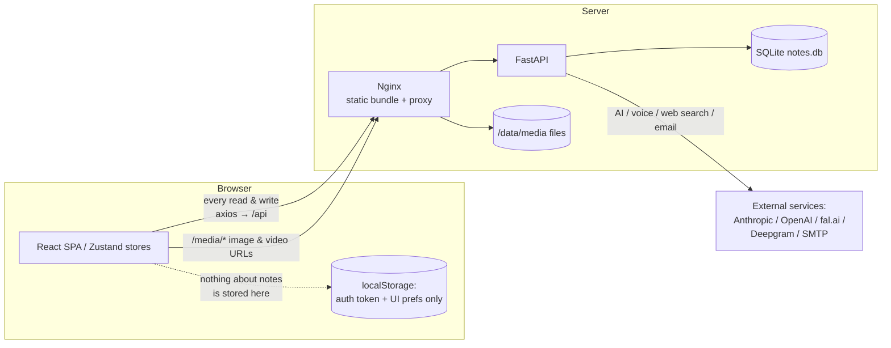
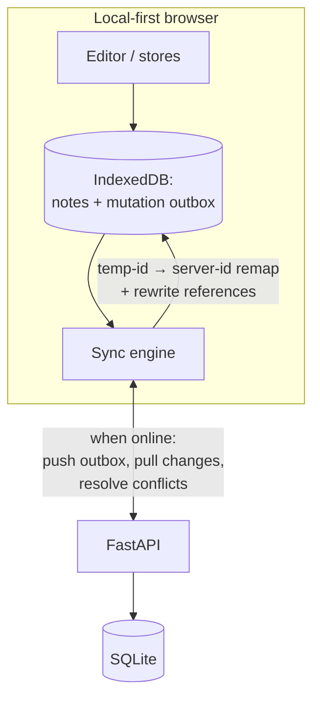

# Offline Mode — Feasibility Study

**Status:** Draft for discussion
**Date:** 2026-08-14
**Scope:** Can Gecko Notes keep working when the browser has no network connection, and what would it take?

---

## 1. Executive summary

Gecko Notes is today a **pure client–server web app**: the React SPA holds no
durable copy of your data and issues a network request for every read and every
write. If the network drops, the app cannot load its own shell, cannot show a
note you were reading a second ago, and silently fails to save edits. So "offline
mode" is **not a toggle we can flip — it is a feature we would build**, and the
cost depends entirely on how much we want to work offline.

The honest breakdown:

| Ambition level | What the user gets offline | Feasibility | Rough effort |
|---|---|---|---|
| **T1 — Installable PWA + offline shell** | The app opens offline instead of showing a browser error; installable to home screen/desktop | ✅ Straightforward, low risk | ~2–4 days |
| **T2 — Read-only offline** | Browse and read notes (and view already-seen images) you previously opened, with no edits | ✅ Feasible, moderate | ~1–2 weeks |
| **T3 — Offline editing + background sync** | Create/edit/delete notes offline; changes sync when back online | ⚠️ Feasible but hard; needs backend changes, a sync engine, and conflict handling | ~4–10 weeks + ongoing complexity |
| **T4 — Fully local-first / desktop app** | The whole app (incl. a local backend) runs with no server at all | ❌ Effectively a re-architecture / different product | Months |

**Recommendation:** Ship **T1 now** (high value, low risk — it removes the worst
offline experience, the blank error page). Then do **T2** to make notes readable
on a plane or a dead-zone commute. Treat **T3 as a separate, deliberately-scoped
project** and only start it if there is real demand — it is where nearly all the
risk and long-term maintenance cost lives. **T4 is out of scope.**

A large share of the product is **inherently online** (AI assistant, voice,
image generation, web search, sharing, email) and can never run offline; any
offline mode must **degrade those features gracefully** rather than pretend to
support them.

---

## 2. How the app works today (why it is online-only)

Everything the UI shows comes from the backend on demand, and every mutation is a
round-trip. There is no local database, no service worker, and no offline
awareness anywhere in the codebase.

Concrete evidence from the code:

- **No local data store.** Note content lives only in the Zustand stores
  (`frontend/src/stores/notes.ts`), which are populated exclusively by API calls
  and are wiped on reload. `localStorage` is used only for the auth token/user and
  UI preferences (panel sizes, theme, view mode) — never for note data. There is
  **no service worker, no web app manifest, and no IndexedDB** anywhere in
  `frontend/src`.
- **Every operation is a server round-trip.** `frontend/src/api/*.ts` all go
  through one axios client (`frontend/src/api/client.ts`); the stores call the API
  and store the response. Offline, these requests reject with a network error and
  the UI has no fallback.
- **The app shell itself is not cached for offline use.** `frontend/nginx.conf`
  serves `index.html` with `Cache-Control: no-cache` (correct for updates, but it
  means a hard reload with no network yields a blank page). Hashed JS/CSS assets
  are cached `1y` immutable, so they *may* survive in the HTTP cache, but with no
  service worker there is no guarantee and no reliable navigation fallback.
- **Autosave fails silently offline.** The editor
  (`frontend/src/views/EditorView.tsx`, `doSave`) debounces a `PUT /notes/:id`.
  On failure it sets status `"Error saving"`, keeps a `hasPendingChanges` flag,
  and retries on the next edit — but the pending content lives **only in editor
  memory**. Close the tab (or reload) while offline and the unsaved edits are
  **lost**. There is no durable outbox.
- **Auth survives offline but is untested against it.** The JWT is in
  `localStorage`, so the user stays "logged in." The response interceptor only
  force-logs-out on an actual `401` response; offline requests have no response, so
  they won't trigger a redirect — but nothing downstream handles the resulting
  rejected promises as "offline" versus "error."

---

## 3. What "offline" can and cannot mean here

A big part of Gecko Notes is a front-end to **external, networked services**.
Those parts have no offline story by definition. Being explicit about this up
front keeps the scope honest.

| Feature area | Offline-capable? | Why |
|---|---|---|
| Read notes you've already opened | ✅ with T2 | Data can be cached locally |
| Browse note list / folders / categories | ✅ with T2 | Same |
| View images/video already viewed | ⚠️ partial | Browser caches `/media` for 30d (`nginx.conf`), but unreliable; T2 can cache deliberately |
| Edit / create / delete notes | ✅ with T3 | Needs local store + sync + conflict handling |
| Upload new images / video | ❌ (queue only) | Bytes can be queued for T3, but not usable until upload |
| Version history snapshots | ⚠️ | Server-driven; would need offline reconciliation |
| AI assistant / plans / metadata | ❌ | Requires Anthropic/OpenAI/DeepSeek/Ollama over network |
| Web search | ❌ | Anthropic server-side tool |
| Voice: read-aloud (TTS) / dictation (STT) / Flux voice mode | ❌ | fal.ai / Deepgram over network (browser STT fallback needs network too) |
| Image generation | ❌ | fal.ai |
| Video transcript generation | ❌ | fal.ai + server ffmpeg |
| Public sharing / social preview | ❌ | Server-rendered, server-stored |
| Email / password reset / 2FA email codes | ❌ | SMTP |
| Registration / login (first time) | ❌ | Server auth; only an existing cached session works offline |

**Design principle for any offline tier:** detect connectivity, and when offline,
**disable and clearly label** the online-only surfaces (grey out the AI panel,
voice buttons, image gen, share menu) rather than letting them throw.

---

## 4. Implementation tiers in detail

### Tier 1 — Installable PWA + offline app shell

**Goal:** opening the app offline shows *the app* (with an "offline" state),
not a browser error page; users can install it to their home screen / desktop.

**What it takes:**
- Add a **service worker** that precaches the built shell (HTML, hashed JS/CSS,
  fonts under `frontend/src/assets/fonts`). Easiest via
  [`vite-plugin-pwa`](https://vite-pwa-org.netlify.app/) (Workbox under the hood),
  which fits the existing Vite build with no bundler surgery.
- Add a **web app manifest** (name, icons, theme color, `display: standalone`).
  Today `index.html` links only a favicon.
- A precache/runtime-cache split so navigations fall back to the cached shell
  when offline, and an update flow (prompt-to-refresh) so a new deploy isn't
  masked by the cache.

**Touchpoints:** `frontend/vite.config.ts`, `frontend/index.html`,
`frontend/nginx.conf` (serve `sw.js` and `manifest.webmanifest` with correct
`Content-Type` and no long-cache on the SW), a couple of icon assets.

**Watch-outs:**
- The service worker registration must be reachable under the current CSP
  (`connect-src 'self'` is fine; SW is same-origin).
- The `no-cache` on `index.html` is good — keep it so shell updates propagate.
- `umami/script.js` is injected in `index.html`; it must not block SW install or
  break offline (it should fail soft).

**Risk:** Low. This is a well-trodden path and delivers immediate value even
before any data is cached: the app becomes installable and stops showing the
dead-page-when-offline experience.

### Tier 2 — Read-only offline

**Goal:** notes, folders, and categories you have already loaded are **readable**
offline; the UI shows cached content and a clear "offline — read only" banner.

**What it takes:**
- A **local cache of API data** in IndexedDB (notes list, opened note bodies,
  categories, folders). A small wrapper (e.g. [`idb`](https://github.com/jakearchibald/idb))
  is enough; a heavier local-first library is not required for read-only.
- Make the Zustand stores **cache-aware**: on a successful fetch, write-through to
  IndexedDB; when a fetch fails and we're offline, read from IndexedDB and mark the
  data stale/read-only.
- **Runtime-cache `/media`** in the service worker (Cache Storage) so images in
  cached notes render offline — a deliberate, cache-first strategy instead of
  relying on the incidental 30-day HTTP cache.
- **Connectivity detection** (`navigator.onLine` + `online`/`offline` events, plus
  a health-check ping to `/api/health`) surfaced as global app state, used to gate
  UI and choose cache-vs-network.

**Touchpoints:** all `frontend/src/api/*.ts` (or a caching layer beneath them),
`frontend/src/stores/*.ts`, service worker runtime rules, a new "offline" UI
banner + disabled states on online-only controls.

**Risk:** Moderate. No backend changes. The main work is disciplined caching and
making every store gracefully handle "no network." Read-only sidesteps every
hard problem below.

### Tier 3 — Offline editing + background sync (the hard part)

**Goal:** create, edit, delete, move, and pin notes offline; changes replay to the
server when connectivity returns; conflicts are handled predictably.

This is where offline mode stops being a caching exercise and becomes a
**distributed-systems problem**. The current backend was built for a single
online client per edit and has none of the machinery sync needs.

**The specific challenges (all confirmed in the current code):**

1. **Server-assigned IDs → temp-ID remapping.**
   `POST /notes` ignores any client ID and assigns `str(uuid.uuid4())`
   (`backend/app/routers/notes.py`; `NoteCreate` in `schemas.py` has no `id`
   field). Offline-created notes therefore need a **client-generated temp ID**
   that must be **remapped** to the server ID on sync — and every reference to it
   rewritten: `folder_id`, `parent_note_id`, and **inline references embedded in
   note content** (the note-reference and child-note blocks store target note IDs
   inside the BlockNote JSON; the backend already parses these out on save). Fix
   options: (a) accept client-supplied UUIDs on create, or (b) build a remap pass.
   Option (a) is cleaner but touches create/validation across entities.

2. **No conflict control — updates are last-write-wins.**
   `PUT /notes/:id` (`update_note`) overwrites unconditionally; `NoteUpdate` carries
   no version/ETag and `modified_at` is not checked. Two devices editing the same
   note offline → **silent data loss** on sync. To do T3 safely we must add
   **optimistic concurrency** (version number or `If-Match`/ETag) and a conflict
   strategy. Because a note body is a single opaque BlockNote JSON blob, automatic
   merging is hard; realistic options are **last-write-wins with a saved "conflict
   copy"** (simple, lossy-but-safe) or adopting a **CRDT** for note content
   (robust, large rework). For a self-hosted, largely single-user app, conflict
   copies are probably the pragmatic choice.

3. **A durable mutation outbox.**
   Replace the current in-memory `hasPendingChanges` flag with a persisted
   **outbox** in IndexedDB so edits survive a reload/crash while offline, with
   ordering, retry, and idempotency (so a replayed create doesn't duplicate).

4. **Delta sync / change feed.**
   Pulling changes needs an efficient "what changed since T?" endpoint (an
   `updated_since` cursor + tombstones for deletes). None exists today; the list
   API is offset-paged, not delta-based.

5. **Media while offline.**
   New images/video must be stored as blobs in the outbox and uploaded on
   reconnect, with the note content's temporary `blob:`/local URLs rewritten to the
   returned `/media` URLs — another remap.

6. **Versioning interaction.**
   Version snapshots are server-timed (`NOTE_VERSION_INTERVAL_MINUTES`). Offline
   edits produce a burst on reconnect; we'd need to decide whether offline edits
   create versions and how they slot into history.

**Risk:** High, and it is *ongoing* — sync bugs are notoriously hard to reproduce
and every future feature that touches notes must stay sync-aware. This tier should
be a project with its own design doc, not a rider on T1/T2.

### Tier 4 — Fully local-first / no server

Running with **no backend at all** (e.g. SQLite compiled to WASM in the browser,
or packaging the FastAPI backend into a desktop app via Tauri/Electron) would make
the app fully self-contained, but it is effectively a **different product
architecture** and would still leave every external-service feature (AI, voice,
etc.) online-only. **Out of scope** for this study.

---

## 5. Recommended roadmap

1. **Phase 1 — T1 (PWA shell + installable).** ~2–4 days. Immediate, low-risk win.
   Removes the blank-page-when-offline failure and makes the app installable.
2. **Phase 2 — T2 (read-only offline).** ~1–2 weeks. Delivers the most-requested
   real-world case: *"let me read my notes on a plane."* No backend changes.
3. **Phase 3 — decision gate.** Only if there is demonstrated demand for offline
   *editing*, scope **T3 as its own project** with a dedicated design doc covering
   the ID-remap, concurrency, outbox, delta-sync, and conflict-UX decisions.
4. **Never (for now):** T4.

This sequencing front-loads value and defers essentially all the risk to a phase
that is entered deliberately.

---

## 6. Effort & risk summary

| Tier | Backend changes? | New moving parts | Effort | Risk |
|---|---|---|---|---|
| T1 PWA shell | None | Service worker, manifest, icons | ~2–4 days | Low |
| T2 Read-only | None | IndexedDB cache, media runtime cache, offline detection, cache-aware stores | ~1–2 weeks | Moderate |
| T3 Offline editing | **Yes** (client IDs, concurrency/ETag, delta feed, tombstones) | Outbox, sync engine, conflict resolution + UX, media queue | ~4–10 weeks | High + ongoing |
| T4 Local-first | Re-architecture | Local DB engine / desktop shell | Months | Very high |

*Effort figures are rough planning estimates, not commitments.*

---

## 7. Key code touchpoints (for whoever picks this up)

- **Build / shell:** `frontend/vite.config.ts`, `frontend/index.html`,
  `frontend/nginx.conf` (SW + manifest headers).
- **Network layer:** `frontend/src/api/client.ts` and all `frontend/src/api/*.ts`
  — the natural seam for a cache/offline wrapper.
- **State:** `frontend/src/stores/notes.ts`, `folders.ts`, `categories.ts`,
  `auth.ts` — must become cache-aware (T2) and outbox-aware (T3).
- **Editor save path:** `frontend/src/views/EditorView.tsx` (`doSave`,
  `scheduleAutosave`) — replace in-memory pending flag with a durable outbox (T3).
- **Reference rewriting (T3):** note-reference & child-note blocks in
  `frontend/src/blocks/`, and the server-side ID extraction in
  `backend/app/routers/notes.py`.
- **Backend for sync (T3):** `NoteCreate`/`NoteUpdate` in `backend/app/schemas.py`
  and `create_note`/`update_note` in `backend/app/routers/notes.py` — client IDs,
  version/ETag concurrency, `updated_since` delta endpoint, delete tombstones.

---

## 8. Open decisions (needed before T3)

1. **Multi-device reality:** is concurrent editing of the same note across devices
   a real scenario, or is this effectively single-user-at-a-time? This decides
   whether conflict-copies suffice or a CRDT is warranted.
2. **Conflict UX:** silently keep both as "conflict copies," or surface a merge/pick
   UI?
3. **Offline creation of images/video:** support queued uploads, or block media
   creation while offline in v1?
4. **Auth expiry offline:** how long should a cached session remain usable with no
   network, and what happens when the JWT expires mid-offline?
5. **Scope of cached data:** cache only opened notes, or proactively sync the whole
   library (size/quota implications for large media)?

---

*This document is a feasibility assessment, not an implementation. No application
behavior has changed.*
